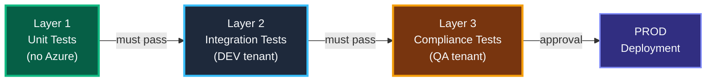

# Solution — Automated Azure Policy Testing with Pester

---

## Problem Statement

The team manually tests every new Azure Policy before rollout:
1. Deploy a test resource → check if the policy configures it correctly
2. Change settings → run remediation → verify it fixes them
3. Repeat for existing resources

**This is slow, error-prone, and doesn't scale.** Every new policy or update needs the same 3-step manual verification across DEV, QA, and PROD tenants.

---

## Proposed Solution (Quick Summary)

**Replace manual tests with 3 layers of Pester tests — each layer catches different problems:**

| Layer | What it checks | Azure needed? | When it runs |
|---|---|---|---|
| **1 — Unit** | JSON is valid, fields exist, effect is correct | **No** | Every PR (seconds) |
| **2 — Integration** | Policy deployed, scope correct, parameters match | DEV tenant | After deploy to DEV |
| **3 — Compliance** | Real resource gets configured, remediation works | QA tenant | After deploy to QA |

**Start with Layer 1 — zero Azure dependency, runs in seconds, catches 80% of mistakes.**

---

## Architecture



---

## Layer 1 — Unit Tests (No Azure, Runs Locally)

> Validate the JSON files BEFORE deploying anything.

### 1A. Generic schema validation for ALL policy definitions

```powershell
# This test auto-discovers every JSON file in the policies folder
# When someone adds a new policy, it gets tested automatically
BeforeDiscovery {
    $policyFiles = Get-ChildItem './policies/definitions' -Filter '*.json' -Recurse |
        ForEach-Object { @{ Name = $_.BaseName; Path = $_.FullName } }
}

# -ForEach creates one test suite per JSON file found above
Describe 'PolicyDefinition <Name>' -ForEach $policyFiles {

    BeforeAll {
        # Read and parse the JSON file once before all tests
        $json = Get-Content $Path -Raw
        $policy = $json | ConvertFrom-Json -ErrorAction Stop
    }

    It 'Is valid JSON' {
        # If the JSON is malformed, ConvertFrom-Json will throw
        { $json | ConvertFrom-Json } | Should -Not -Throw
    }

    It 'Has a displayName (required for Azure portal)' {
        $policy.properties.displayName | Should -Not -BeNullOrEmpty
    }

    It 'Has a policyType of Custom (not BuiltIn)' {
        $policy.properties.policyType | Should -Be 'Custom'
    }

    It 'Has a policyRule with if/then structure' {
        # Every policy needs a condition (if) and an action (then)
        $policy.properties.policyRule.if | Should -Not -BeNullOrEmpty
        $policy.properties.policyRule.then | Should -Not -BeNullOrEmpty
    }

    It 'Effect is one of the valid Azure Policy effects' {
        $effect = $policy.properties.policyRule.then.effect
        # Some policies use "[parameters('effect')]" — that's also valid
        if ($effect -notmatch '\[parameters') {
            $effect | Should -BeIn @('Audit', 'Deny', 'DeployIfNotExists',
                'AuditIfNotExists', 'Modify', 'Disabled')
        }
    }
}
```

### 1B. NSG-specific policy validation

```powershell
BeforeAll {
    # Load the specific NSG diagnostic policy JSON
    $policy = Get-Content './policies/definitions/nsg-diagnostic-log.json' -Raw |
        ConvertFrom-Json
    $rule = $policy.properties.policyRule
}

Describe 'NSG Diagnostic Log Policy' {

    It 'Targets NSG resources (Microsoft.Network/networkSecurityGroups)' {
        # The policy should only apply to NSG resources
        $rule.if.equals | Should -Be 'Microsoft.Network/networkSecurityGroups'
    }

    It 'Uses DeployIfNotExists effect (auto-configures resources)' {
        # DeployIfNotExists = if diagnostic settings are missing, deploy them
        $rule.then.effect | Should -Be 'DeployIfNotExists'
    }

    It 'Enables NetworkSecurityGroupEvent logging category' {
        # This is one of the two required security log categories
        $logs = $rule.then.details.deployment.properties.template.resources.properties.logs
        $event = $logs | Where-Object { $_.category -eq 'NetworkSecurityGroupEvent' }
        $event.enabled | Should -Be $true
    }

    It 'Enables NetworkSecurityGroupRuleCounter logging category' {
        # This is the second required security log category
        $logs = $rule.then.details.deployment.properties.template.resources.properties.logs
        $counter = $logs | Where-Object { $_.category -eq 'NetworkSecurityGroupRuleCounter' }
        $counter.enabled | Should -Be $true
    }

    It 'Points to the correct Log Analytics workspace' {
        # The workspace where SIEM collects the logs
        $policy.properties.parameters.logAnalytics.defaultValue |
            Should -Match 'your-log-analytics-workspace-name'
    }
}
```

---

## Layer 2 — Integration Tests (After Deploy to DEV)

> Verify the policy actually exists in Azure with the right settings.

```powershell
# These tests run AFTER the pipeline deploys policies to DEV
# They need an Azure connection (service principal in the pipeline)

Describe 'Policy Deployment Verification' {

    BeforeAll {
        # Get all custom policies from the connected tenant
        $definitions = Get-AzPolicyDefinition -Custom
        $assignments = Get-AzPolicyAssignment
    }

    It 'NSG Diagnostic policy exists in Azure' {
        # After deployment, the policy definition should be in the tenant
        $nsg = $definitions | Where-Object {
            $_.Properties.DisplayName -like '*NSG*Diagnostic*'
        }
        $nsg | Should -Not -BeNullOrEmpty
    }

    It 'NSG policy is assigned at the correct management group scope' {
        # The assignment should target the right scope (your management group)
        $assignment = $assignments | Where-Object {
            $_.Properties.DisplayName -like '*NSG*Diagnostic*'
        }
        $assignment.Properties.Scope | Should -Match 'YourManagementGroup'
    }

    It 'Assignment is in enforcing mode (not DoNotEnforce)' {
        # DoNotEnforce = audit only. We want Default = actually enforce
        $assignment = $assignments | Where-Object {
            $_.Properties.DisplayName -like '*NSG*Diagnostic*'
        }
        $assignment.Properties.EnforcementMode | Should -Be 'Default'
    }
}
```

---

## Layer 3 — Compliance Tests (Replaces Manual Testing)

> This is the automated version of the 3-step manual test plan.

```powershell
# STEP 1: Deploy a test NSG and check if policy configures it
BeforeAll {
    $testRG = 'rg-pester-policy-test'
    $testNSG = 'nsg-pester-test'

    # Create a test resource group and NSG
    New-AzResourceGroup -Name $testRG -Location 'westeurope' -Force
    New-AzNetworkSecurityGroup -ResourceGroupName $testRG `
        -Name $testNSG -Location 'westeurope' -Force

    # Wait for Azure Policy to evaluate the new resource
    # Policy evaluation happens every ~15 minutes, or on-demand via trigger
    Write-Host "Waiting 60s for policy evaluation..."
    Start-Sleep -Seconds 60
}

# Clean up after all tests complete
AfterAll {
    Remove-AzResourceGroup -Name $testRG -Force -AsJob
}

Describe 'Step 1 — Deploy and Verify (was manual test #1)' {

    It 'Diagnostic setting "service" was auto-created by policy' {
        # The DeployIfNotExists policy should have created this automatically
        $nsg = Get-AzNetworkSecurityGroup -ResourceGroupName $testRG -Name $testNSG
        $diag = Get-AzDiagnosticSetting -ResourceId $nsg.Id -Name 'service' `
            -ErrorAction SilentlyContinue
        $diag | Should -Not -BeNullOrEmpty
    }

    It 'NSG Event logging is enabled' {
        $nsg = Get-AzNetworkSecurityGroup -ResourceGroupName $testRG -Name $testNSG
        $diag = Get-AzDiagnosticSetting -ResourceId $nsg.Id -Name 'service'
        $event = $diag.Logs | Where-Object { $_.Category -eq 'NetworkSecurityGroupEvent' }
        $event.Enabled | Should -Be $true
    }

    It 'Logs go to the correct workspace' {
        $nsg = Get-AzNetworkSecurityGroup -ResourceGroupName $testRG -Name $testNSG
        $diag = Get-AzDiagnosticSetting -ResourceId $nsg.Id -Name 'service'
        # Check the workspace name appears in the workspace resource ID
        $diag.WorkspaceId | Should -Match 'your-log-analytics-workspace-name'
    }
}

Describe 'Step 2 — Drift and Remediate (was manual test #2)' {

    BeforeAll {
        # Break the config on purpose (simulate someone changing settings)
        $nsg = Get-AzNetworkSecurityGroup -ResourceGroupName $testRG -Name $testNSG
        Remove-AzDiagnosticSetting -ResourceId $nsg.Id -Name 'service' `
            -ErrorAction SilentlyContinue

        # Trigger remediation (the policy should fix it)
        $policy = Get-AzPolicyAssignment | Where-Object {
            $_.Properties.DisplayName -like '*NSG*Diagnostic*'
        }
        Start-AzPolicyRemediation -Name 'pester-test' `
            -PolicyAssignmentId $policy.PolicyAssignmentId `
            -ResourceGroupName $testRG

        Write-Host "Waiting 120s for remediation..."
        Start-Sleep -Seconds 120
    }

    It 'Diagnostic setting is restored after remediation' {
        $nsg = Get-AzNetworkSecurityGroup -ResourceGroupName $testRG -Name $testNSG
        $diag = Get-AzDiagnosticSetting -ResourceId $nsg.Id -Name 'service' `
            -ErrorAction SilentlyContinue
        $diag | Should -Not -BeNullOrEmpty
    }

    It 'Both log categories are re-enabled' {
        $nsg = Get-AzNetworkSecurityGroup -ResourceGroupName $testRG -Name $testNSG
        $diag = Get-AzDiagnosticSetting -ResourceId $nsg.Id -Name 'service'
        ($diag.Logs | Where-Object { $_.Enabled }).Count | Should -BeGreaterOrEqual 2
    }
}
```

---

## Azure DevOps Pipeline

```yaml
stages:
  # Layer 1 runs on every PR — no Azure needed, takes seconds
  - stage: UnitTests
    jobs:
    - job: Pester
      pool: { vmImage: windows-latest }
      steps:
      - pwsh: |
          Install-Module Pester -Force -Scope CurrentUser
          $config = New-PesterConfiguration
          $config.Run.Path = './tests/Unit'       # Only unit tests
          $config.Run.Exit = $true                # Fail the build on test failure
          Invoke-Pester -Configuration $config

  # Layer 2 runs after deploying to DEV
  - stage: IntegrationTests
    dependsOn: DeployDEV
    jobs:
    - job: Pester
      steps:
      - task: AzurePowerShell@5
        inputs:
          azureSubscription: 'DEV-ServiceConnection'
          ScriptType: InlineScript
          Inline: |
            Install-Module Pester -Force -Scope CurrentUser
            $config = New-PesterConfiguration
            $config.Run.Path = './tests/Integration'
            $config.Run.Exit = $true
            Invoke-Pester -Configuration $config

  # Layer 3 runs after deploying to QA — replaces all manual testing
  - stage: ComplianceTests
    dependsOn: DeployQA
    timeoutInMinutes: 30
    jobs:
    - job: Pester
      steps:
      - task: AzurePowerShell@5
        inputs:
          azureSubscription: 'QA-ServiceConnection'
          ScriptType: InlineScript
          Inline: |
            Install-Module Pester -Force -Scope CurrentUser
            $config = New-PesterConfiguration
            $config.Run.Path = './tests/Compliance'
            $config.Run.Exit = $true
            Invoke-Pester -Configuration $config

  # PROD only after all 3 layers pass + manual approval
  - stage: DeployPROD
    dependsOn: ComplianceTests
    # Environment has an approval gate configured
```

---

## Quick Wins — Start Here

| Priority | What to do | Effort | Value |
|---|---|---|---|
| **1** | JSON schema tests for all policy definitions | Half a day | Catches broken JSON before deploy |
| **2** | NSG-specific structure tests (the example above) | Half a day | Replaces manual step 1 (structure check) |
| **3** | Post-deploy integration tests (policy exists in Azure) | 1 day | Replaces manual Azure portal checks |
| **4** | Full compliance tests (deploy → verify → remediate) | 2-3 days | Replaces the entire manual test plan |

---

## Recommended Folder Structure

```
AzPolicyAutomationV2/
├── policies/
│   ├── definitions/          ← Policy JSON files
│   ├── sets/                 ← PolicySet JSON files
│   └── assignments/          ← Assignment JSON files
├── tests/
│   ├── Unit/                 ← Layer 1 (no Azure)
│   ├── Integration/          ← Layer 2 (DEV tenant)
│   └── Compliance/           ← Layer 3 (QA tenant)
└── azure-pipelines.yml
```

---

## Key Recommendations

1. **Start with Layer 1** — zero Azure cost, runs in seconds, catches 80% of issues
2. **Use `BeforeDiscovery`** — new policy JSON files get tested automatically
3. **Tag your tests** — `Unit`, `Integration`, `Compliance` — run the right set at the right stage
4. **Layer 3 needs timeouts** — policy evaluation takes 1-15 minutes
5. **Clean up test resources** — use `AfterAll` to delete test NSGs
6. **PROD needs approval** — all 3 layers pass, then a human approves