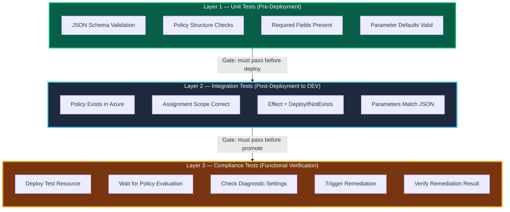

# Solution — Automated Azure Policy Testing with Pester

> **For:** AzPolicyAutomationV2 team  
> **Approach:** 3-layer testing strategy — Unit → Integration → Compliance  
> **Tooling:** Pester 5 + Azure DevOps Pipelines + Az PowerShell module

---

## Architecture — 3-Layer Testing Strategy



| Layer | When | Speed | Azure Needed? | Blocks What? |
|---|---|---|---|---|
| **1 — Unit** | Every commit, PR | Seconds | No | Merge to main |
| **2 — Integration** | After deploy to DEV | Minutes | DEV tenant | Promotion to QA |
| **3 — Compliance** | After deploy to QA | Minutes–hours | QA tenant | Promotion to PROD |

---

## Layer 1 — Unit Tests (No Azure Connection)

These run **locally or in CI** without touching Azure. They validate the JSON artifacts.

### 1A. JSON Schema Validation

```powershell
# File: tests/Unit/PolicyDefinition.Schema.Tests.ps1

BeforeDiscovery {
    # Dynamically discover all policy definition JSON files
    $policyFiles = Get-ChildItem './policies/definitions' -Filter '*.json' -Recurse |
        ForEach-Object { @{ Name = $_.BaseName; Path = $_.FullName } }
}

Describe 'PolicyDefinition <Name> — Schema Validation' -ForEach $policyFiles {

    BeforeAll {
        $json = Get-Content $Path -Raw
        $policy = $json | ConvertFrom-Json -ErrorAction Stop
    }

    It 'Is valid JSON' {
        { $json | ConvertFrom-Json } | Should -Not -Throw
    }

    It 'Has a displayName' {
        $policy.properties.displayName | Should -Not -BeNullOrEmpty
    }

    It 'Has a description' {
        $policy.properties.description | Should -Not -BeNullOrEmpty
    }

    It 'Has a policyType of Custom' {
        $policy.properties.policyType | Should -Be 'Custom'
    }

    It 'Has a valid mode (All or Indexed)' {
        $policy.properties.mode | Should -BeIn @('All', 'Indexed')
    }

    It 'Has a policyRule with if/then' {
        $policy.properties.policyRule.if | Should -Not -BeNullOrEmpty
        $policy.properties.policyRule.then | Should -Not -BeNullOrEmpty
    }

    It 'Effect is a valid value' {
        $effect = $policy.properties.policyRule.then.effect
        # Effect can be a parameter reference like "[parameters('effect')]"
        if ($effect -notmatch '\[parameters') {
            $effect | Should -BeIn @('Audit', 'Deny', 'DeployIfNotExists',
                'AuditIfNotExists', 'Modify', 'Disabled', 'Append', 'DenyAction')
        }
    }
}
```

### 1B. NSG Diagnostic Policy — Specific Validations

```powershell
# File: tests/Unit/NSG-DiagnosticLog-Policy.Tests.ps1

BeforeAll {
    $policyPath = './policies/definitions/nsg-diagnostic-log.json'
    $policy = Get-Content $policyPath -Raw | ConvertFrom-Json
    $rule = $policy.properties.policyRule
}

Describe 'NSG Diagnostic Log Policy — Structure' {

    It 'Targets Microsoft.Network/networkSecurityGroups' {
        $rule.if.field | Should -Be 'type'
        $rule.if.equals | Should -Be 'Microsoft.Network/networkSecurityGroups'
    }

    It 'Effect is DeployIfNotExists' {
        $rule.then.effect | Should -Be 'DeployIfNotExists'
    }

    It 'Deploys a diagnostic setting' {
        $deployment = $rule.then.details
        $deployment.type | Should -Be 'Microsoft.Insights/diagnosticSettings'
    }

    It 'Configures the "service" diagnostic setting name' {
        $deployment = $rule.then.details.deployment.properties.template
        # Navigate ARM template to find the diagnostic setting name
        $settingName = $deployment.resources |
            Where-Object { $_.type -eq 'Microsoft.Insights/diagnosticSettings' } |
            Select-Object -ExpandProperty name
        $settingName | Should -Match 'service'
    }

    It 'Enables NetworkSecurityGroupEvent category' {
        $logs = $rule.then.details.deployment.properties.template.resources.properties.logs
        $nsgEvent = $logs | Where-Object { $_.category -eq 'NetworkSecurityGroupEvent' }
        $nsgEvent.enabled | Should -Be $true
    }

    It 'Enables NetworkSecurityGroupRuleCounter category' {
        $logs = $rule.then.details.deployment.properties.template.resources.properties.logs
        $counter = $logs | Where-Object { $_.category -eq 'NetworkSecurityGroupRuleCounter' }
        $counter.enabled | Should -Be $true
    }

    It 'Sends to the correct Log Analytics workspace' {
        $workspaceParam = $policy.properties.parameters.logAnalytics
        $workspaceParam.defaultValue | Should -Match 'monitoring-chub01-firstwave'
    }
}
```

### 1C. PolicyAssignment Validation

```powershell
# File: tests/Unit/PolicyAssignment.Schema.Tests.ps1

BeforeDiscovery {
    $assignmentFiles = Get-ChildItem './policies/assignments' -Filter '*.json' -Recurse |
        ForEach-Object { @{ Name = $_.BaseName; Path = $_.FullName } }
}

Describe 'PolicyAssignment <Name> — Validation' -ForEach $assignmentFiles {

    BeforeAll {
        $assignment = Get-Content $Path -Raw | ConvertFrom-Json
    }

    It 'Has a displayName' {
        $assignment.properties.displayName | Should -Not -BeNullOrEmpty
    }

    It 'Has a policyDefinitionId' {
        $assignment.properties.policyDefinitionId | Should -Not -BeNullOrEmpty
    }

    It 'Scope is a valid management group or subscription' {
        $assignment.properties.scope | Should -Match '^/providers/Microsoft.Management/managementGroups/|^/subscriptions/'
    }

    It 'Has enforcementMode set' {
        $assignment.properties.enforcementMode | Should -BeIn @('Default', 'DoNotEnforce')
    }
}
```

---

## Layer 2 — Integration Tests (Against DEV Tenant)

These run **after deployment to DEV** and verify the policies exist in Azure with correct settings.

```powershell
# File: tests/Integration/PolicyDeployment.Tests.ps1

BeforeAll {
    # Connect to DEV tenant (service principal in pipeline)
    # Connect-AzAccount is handled by the pipeline task
    $definitions = Get-AzPolicyDefinition -Custom
    $assignments = Get-AzPolicyAssignment
}

Describe 'Policy Deployment Verification — DEV Tenant' {

    Context 'Custom Policy Definitions' {

        It 'NSG Diagnostic Log policy exists' {
            $nsgPolicy = $definitions | Where-Object {
                $_.Properties.DisplayName -like '*NSG*Diagnostic*'
            }
            $nsgPolicy | Should -Not -BeNullOrEmpty
        }

        It 'NSG policy has correct resource type filter' {
            $nsgPolicy = $definitions | Where-Object {
                $_.Properties.DisplayName -like '*NSG*Diagnostic*'
            }
            $rule = $nsgPolicy.Properties.PolicyRule
            $rule.if.equals | Should -Be 'Microsoft.Network/networkSecurityGroups'
        }

        It 'NSG policy effect is DeployIfNotExists' {
            $nsgPolicy = $definitions | Where-Object {
                $_.Properties.DisplayName -like '*NSG*Diagnostic*'
            }
            $nsgPolicy.Properties.PolicyRule.then.effect | Should -Be 'DeployIfNotExists'
        }
    }

    Context 'Policy Assignments' {

        It 'NSG Diagnostic policy is assigned at the correct scope' {
            $nsgAssignment = $assignments | Where-Object {
                $_.Properties.DisplayName -like '*NSG*Diagnostic*'
            }
            $nsgAssignment | Should -Not -BeNullOrEmpty
            $nsgAssignment.Properties.Scope | Should -Match 'ManagementRoot'
        }

        It 'Assignment enforcement mode is Default (enforcing)' {
            $nsgAssignment = $assignments | Where-Object {
                $_.Properties.DisplayName -like '*NSG*Diagnostic*'
            }
            $nsgAssignment.Properties.EnforcementMode | Should -Be 'Default'
        }
    }
}
```

---

## Layer 3 — Compliance Tests (Functional Verification in QA)

These replicate the **manual test plan** — deploy a test NSG, verify diagnostic settings, test remediation.

```powershell
# File: tests/Compliance/NSG-DiagnosticLog.Compliance.Tests.ps1

BeforeAll {
    $testRG = 'rg-pester-policy-test'
    $testNSG = 'nsg-pester-test'
    $testLocation = 'westeurope'
    $expectedWorkspace = 'monitoring-chub01-firstwave'

    # Create test resource group
    New-AzResourceGroup -Name $testRG -Location $testLocation -Force

    # Deploy a test NSG
    New-AzNetworkSecurityGroup -ResourceGroupName $testRG -Name $testNSG -Location $testLocation -Force

    # Wait for Azure Policy to evaluate (policy evaluation cycle)
    Write-Host "Waiting 60s for policy evaluation..." -ForegroundColor Yellow
    Start-Sleep -Seconds 60
}

AfterAll {
    # Clean up test resources
    Remove-AzResourceGroup -Name $testRG -Force -AsJob
}

Describe 'Manual Test Step 1 — Deploy and Verify' -Tag 'Compliance' {

    It 'NSG exists in the test resource group' {
        $nsg = Get-AzNetworkSecurityGroup -ResourceGroupName $testRG -Name $testNSG
        $nsg | Should -Not -BeNullOrEmpty
    }

    It 'Diagnostic setting "service" is configured' {
        $diag = Get-AzDiagnosticSetting -ResourceId (
            Get-AzNetworkSecurityGroup -ResourceGroupName $testRG -Name $testNSG
        ).Id -Name 'service' -ErrorAction SilentlyContinue
        $diag | Should -Not -BeNullOrEmpty
    }

    It 'NetworkSecurityGroupEvent category is enabled' {
        $nsg = Get-AzNetworkSecurityGroup -ResourceGroupName $testRG -Name $testNSG
        $diag = Get-AzDiagnosticSetting -ResourceId $nsg.Id -Name 'service'
        $eventLog = $diag.Logs | Where-Object { $_.Category -eq 'NetworkSecurityGroupEvent' }
        $eventLog.Enabled | Should -Be $true
    }

    It 'NetworkSecurityGroupRuleCounter category is enabled' {
        $nsg = Get-AzNetworkSecurityGroup -ResourceGroupName $testRG -Name $testNSG
        $diag = Get-AzDiagnosticSetting -ResourceId $nsg.Id -Name 'service'
        $counter = $diag.Logs | Where-Object { $_.Category -eq 'NetworkSecurityGroupRuleCounter' }
        $counter.Enabled | Should -Be $true
    }

    It 'Sends to the correct Log Analytics workspace' {
        $nsg = Get-AzNetworkSecurityGroup -ResourceGroupName $testRG -Name $testNSG
        $diag = Get-AzDiagnosticSetting -ResourceId $nsg.Id -Name 'service'
        $diag.WorkspaceId | Should -Match $expectedWorkspace
    }
}

Describe 'Manual Test Step 2 — Drift and Remediate' -Tag 'Compliance' {

    BeforeAll {
        # Simulate drift: remove the diagnostic setting
        $nsg = Get-AzNetworkSecurityGroup -ResourceGroupName $testRG -Name $testNSG
        Remove-AzDiagnosticSetting -ResourceId $nsg.Id -Name 'service' -ErrorAction SilentlyContinue

        # Trigger remediation
        $policy = Get-AzPolicyAssignment | Where-Object {
            $_.Properties.DisplayName -like '*NSG*Diagnostic*'
        }
        Start-AzPolicyRemediation -Name 'pester-remediation-test' `
            -PolicyAssignmentId $policy.PolicyAssignmentId `
            -ResourceGroupName $testRG

        # Wait for remediation
        Write-Host "Waiting 120s for remediation..." -ForegroundColor Yellow
        Start-Sleep -Seconds 120
    }

    It 'Diagnostic setting is restored after remediation' {
        $nsg = Get-AzNetworkSecurityGroup -ResourceGroupName $testRG -Name $testNSG
        $diag = Get-AzDiagnosticSetting -ResourceId $nsg.Id -Name 'service' -ErrorAction SilentlyContinue
        $diag | Should -Not -BeNullOrEmpty
    }

    It 'All log categories are re-enabled' {
        $nsg = Get-AzNetworkSecurityGroup -ResourceGroupName $testRG -Name $testNSG
        $diag = Get-AzDiagnosticSetting -ResourceId $nsg.Id -Name 'service'
        ($diag.Logs | Where-Object { $_.Enabled -eq $true }).Count | Should -BeGreaterOrEqual 2
    }
}
```

---

## Azure DevOps Pipeline Integration

```yaml
# azure-pipelines.yml

trigger:
  branches:
    include: [main, develop]
  paths:
    include: [policies/]

stages:
  # ────────────────────────────────────────
  # STAGE 1: Unit Tests (no Azure connection)
  # ────────────────────────────────────────
  - stage: UnitTests
    displayName: 'Layer 1 — Unit Tests'
    jobs:
    - job: Pester
      pool:
        vmImage: windows-latest
      steps:
      - task: PowerShell@2
        displayName: 'Run Pester Unit Tests'
        inputs:
          targetType: inline
          pwsh: true
          script: |
            Install-Module Pester -Force -Scope CurrentUser
            $config = New-PesterConfiguration
            $config.Run.Path = './tests/Unit'
            $config.Run.Exit = $true
            $config.TestResult.Enabled = $true
            $config.TestResult.OutputFormat = 'NUnitXml'
            $config.TestResult.OutputPath = './test-results-unit.xml'
            Invoke-Pester -Configuration $config
      - task: PublishTestResults@2
        inputs:
          testResultsFormat: NUnit
          testResultsFiles: '**/test-results-unit.xml'

  # ────────────────────────────────────────
  # STAGE 2: Deploy to DEV + Integration Tests
  # ────────────────────────────────────────
  - stage: DeployDEV
    displayName: 'Deploy to DEV'
    dependsOn: UnitTests
    jobs:
    - deployment: DeployPolicies
      environment: DEV
      strategy:
        runOnce:
          deploy:
            steps:
            - task: AzurePowerShell@5
              displayName: 'Deploy Policies'
              inputs:
                azureSubscription: 'DEV-ServiceConnection'
                ScriptPath: './scripts/Deploy-Policies.ps1'
                azurePowerShellVersion: LatestVersion

  - stage: IntegrationTests
    displayName: 'Layer 2 — Integration Tests (DEV)'
    dependsOn: DeployDEV
    jobs:
    - job: PesterIntegration
      pool:
        vmImage: windows-latest
      steps:
      - task: AzurePowerShell@5
        displayName: 'Run Integration Tests'
        inputs:
          azureSubscription: 'DEV-ServiceConnection'
          ScriptType: InlineScript
          Inline: |
            Install-Module Pester -Force -Scope CurrentUser
            $config = New-PesterConfiguration
            $config.Run.Path = './tests/Integration'
            $config.Run.Exit = $true
            $config.Filter.Tag = @('Integration')
            $config.TestResult.Enabled = $true
            $config.TestResult.OutputPath = './test-results-integration.xml'
            Invoke-Pester -Configuration $config
          azurePowerShellVersion: LatestVersion

  # ────────────────────────────────────────
  # STAGE 3: Deploy to QA + Compliance Tests
  # ────────────────────────────────────────
  - stage: DeployQA
    displayName: 'Deploy to QA'
    dependsOn: IntegrationTests
    jobs:
    - deployment: DeployPolicies
      environment: QA
      strategy:
        runOnce:
          deploy:
            steps:
            - task: AzurePowerShell@5
              inputs:
                azureSubscription: 'QA-ServiceConnection'
                ScriptPath: './scripts/Deploy-Policies.ps1'

  - stage: ComplianceTests
    displayName: 'Layer 3 — Compliance Tests (QA)'
    dependsOn: DeployQA
    jobs:
    - job: PesterCompliance
      timeoutInMinutes: 30
      pool:
        vmImage: windows-latest
      steps:
      - task: AzurePowerShell@5
        displayName: 'Run Compliance Tests'
        inputs:
          azureSubscription: 'QA-ServiceConnection'
          ScriptType: InlineScript
          Inline: |
            Install-Module Pester -Force -Scope CurrentUser
            $config = New-PesterConfiguration
            $config.Run.Path = './tests/Compliance'
            $config.Run.Exit = $true
            $config.Filter.Tag = @('Compliance')
            $config.TestResult.Enabled = $true
            $config.TestResult.OutputPath = './test-results-compliance.xml'
            Invoke-Pester -Configuration $config
          azurePowerShellVersion: LatestVersion

  # ────────────────────────────────────────
  # STAGE 4: Deploy to PROD (manual approval)
  # ────────────────────────────────────────
  - stage: DeployPROD
    displayName: 'Deploy to PROD'
    dependsOn: ComplianceTests
    jobs:
    - deployment: DeployPolicies
      environment: PROD   # Has approval gate configured
      strategy:
        runOnce:
          deploy:
            steps:
            - task: AzurePowerShell@5
              inputs:
                azureSubscription: 'PROD-ServiceConnection'
                ScriptPath: './scripts/Deploy-Policies.ps1'
```

---

## Recommended Folder Structure for AzPolicyAutomationV2

```
AzPolicyAutomationV2/
├── policies/
│   ├── definitions/                    ← Custom PolicyDefinition JSON files
│   │   ├── nsg-diagnostic-log.json
│   │   ├── storage-https-only.json
│   │   └── ...
│   ├── sets/                           ← Custom PolicySetDefinition JSON files
│   │   └── security-baseline.json
│   └── assignments/                    ← PolicyAssignment JSON files
│       ├── nsg-diagnostic-assignment.json
│       └── ...
├── scripts/
│   └── Deploy-Policies.ps1            ← Deployment script
├── tests/
│   ├── Unit/                           ← Layer 1: JSON validation (no Azure)
│   │   ├── PolicyDefinition.Schema.Tests.ps1
│   │   ├── NSG-DiagnosticLog-Policy.Tests.ps1
│   │   └── PolicyAssignment.Schema.Tests.ps1
│   ├── Integration/                    ← Layer 2: Post-deploy checks (DEV)
│   │   └── PolicyDeployment.Tests.ps1
│   └── Compliance/                     ← Layer 3: Functional verification (QA)
│       └── NSG-DiagnosticLog.Compliance.Tests.ps1
├── azure-pipelines.yml
└── PesterConfiguration.psd1
```

---

## Quick Wins — Start Here

| Priority | Action | Effort | Impact |
|---|---|---|---|
| **1** | JSON schema validation for all policy definitions | 1 day | Catches malformed policies before deploy |
| **2** | Required-fields check (displayName, effect, policyType) | 0.5 day | Prevents silent failures |
| **3** | NSG-specific diagnostic settings validation | 0.5 day | Replaces manual test step 1 (structure only) |
| **4** | Post-deploy integration tests (policy exists, correct scope) | 1 day | Replaces manual Azure portal checks |
| **5** | Compliance tests with deploy→verify→remediate cycle | 2-3 days | Replaces the full 3-step manual test plan |

---

## Key Recommendations

1. **Start with Layer 1 (Unit Tests)** — zero Azure dependency, runs in seconds, gives immediate value
2. **Use `BeforeDiscovery` + `-ForEach`** to auto-discover all JSON files — new policies get tested automatically
3. **Tag tests** with `-Tag 'Unit'`, `'Integration'`, `'Compliance'` — run the right set at the right stage
4. **Layer 3 tests need timeouts** — policy evaluation and remediation cycles take 1-5 minutes
5. **Use Azure DevOps environments** with approval gates — PROD deployment requires human approval after all tests pass
6. **One test file per policy** for Layer 1 (specific structural checks) + one generic schema test for all policies
7. **Compliance tests create and destroy resources** — use `AfterAll` to clean up test NSGs, VMs, etc.
