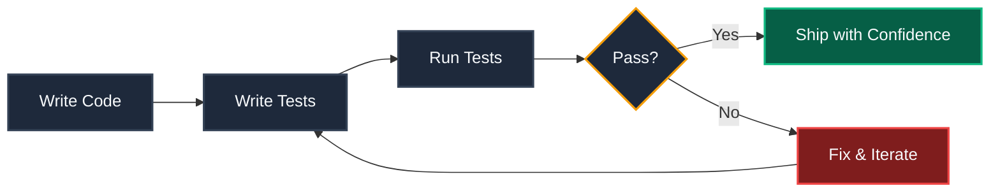
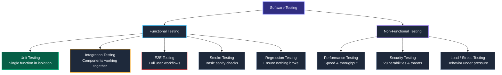
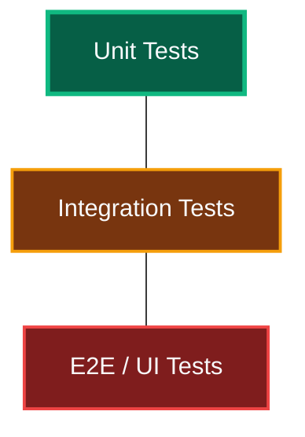
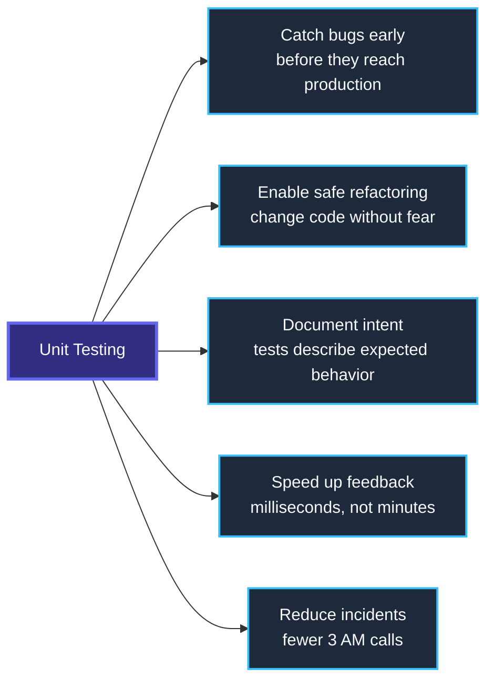
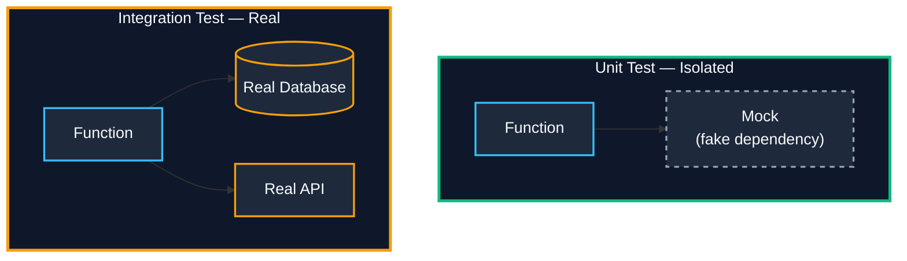
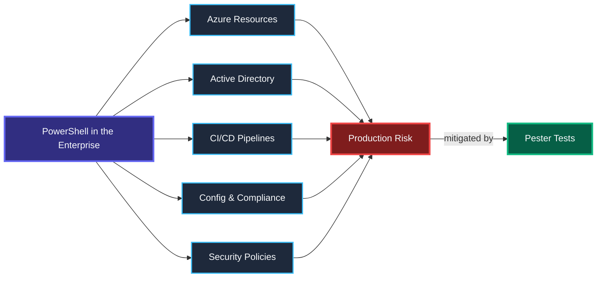
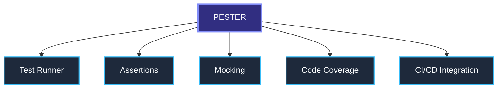
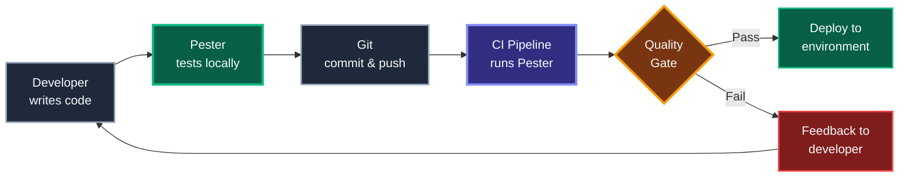
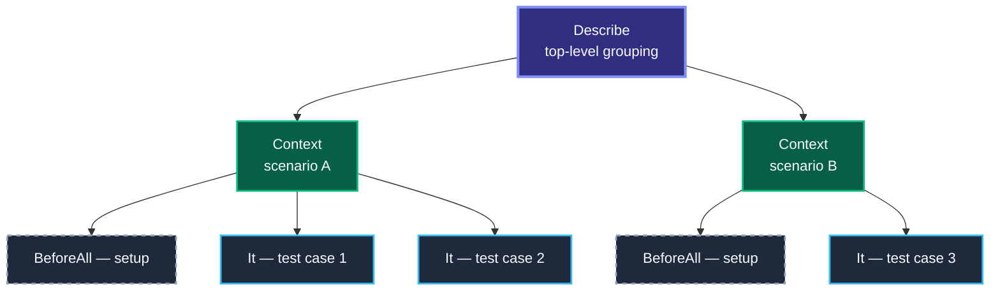

# Fundamentals of Unit Testing — Introduction & Context

---

## What Is Software Testing?

Software testing is the practice of **verifying that code behaves as expected** before it reaches production. It reduces risk, increases confidence, and creates a safety net for change.



---

## Types of Software Testing

Before diving into unit tests, it helps to see the **full landscape** of testing approaches.



| Type | Purpose | Speed | Example |
|---|---|---|---|
| **Unit** | Test a single function in isolation | Milliseconds | Does `Get-UserAge` return correct value? |
| **Integration** | Test components working together | Seconds | Does the function connect to the DB correctly? |
| **E2E** | Test full user/system workflow | Minutes | Does the deployment pipeline complete? |
| **Smoke** | Quick sanity — does it even start? | Fast | Does the module import without errors? |
| **Regression** | Verify old bugs stay fixed | Varies | Re-run all tests after a code change |
| **Negative** | Verify correct behavior on bad input | Fast | Does it throw on `$null` input? |
| **Idempotency** | Same result on repeated execution | Medium | Running the script twice produces no side effects |

---

## The Testing Pyramid

Not all tests are equal. The pyramid prioritizes **fast, cheap, isolated tests** at the base.



| Layer | % of Tests | Speed | Cost | Characteristics |
|---|---|---|---|---|
| **E2E / UI** | ~10% | Slow (minutes) | High | Fragile, tests full workflows |
| **Integration** | ~20% | Medium (seconds) | Medium | Uses real dependencies |
| **Unit** | ~70% | Fast (milliseconds) | Low | Isolated, mocked, most tests live here |

---

## Why Unit Testing Matters



> A bug found in development costs **10x less** to fix than a bug found in production.

---

## Unit Testing vs Integration Testing



| Aspect | Unit Test | Integration Test |
|---|---|---|
| **Dependencies** | Mocked / stubbed | Real services |
| **Speed** | Very fast | Slower |
| **Failure cause** | Clear & isolated | Ambiguous |
| **When to use** | Logic, branching, calculations | End-to-end flows, API contracts |

---

## Why Testing PowerShell in the Enterprise?

PowerShell is no longer just a scripting language — in the enterprise it is **infrastructure as code**. Scripts manage Azure subscriptions, configure Active Directory, orchestrate CI/CD pipelines, and enforce compliance policies. A single untested script can cause outages, security gaps, or audit failures across environments.



### Enterprise Pain Points Without Tests

| Scenario | Without Tests | With Pester Tests |
|---|---|---|
| Deploy Azure resources | "I think the script works" | "I *know* it works — tests prove it" |
| Refactor a shared module | Fear of breaking things | Confidence from passing tests |
| New team member changes code | No safety net, silent failures | Tests catch regressions immediately |
| Audit / compliance review | No evidence of validation | Test reports as compliance artifacts |
| Production incident at 3 AM | Long debugging, unclear root cause | Tests pinpoint the broken logic |

---

## What Is Pester?

> **Pester** is the ubiquitous **test and mock framework for PowerShell** — the standard tool for writing, running, and automating PowerShell tests.

### At a Glance

| Detail | Value |
|---|---|
| **Latest version** | 5.7.1 (Jan 2025) |
| **GitHub stars** | 3,300+ |
| **Contributors** | 147+ |
| **Platforms** | Windows, Linux, macOS |
| **PowerShell** | 5.1 and 7.2+ |
| **Install** | `Install-Module -Name Pester -Force` |
| **Run tests** | `Invoke-Pester ./tests` |
| **Docs** | [pester.dev](https://pester.dev/) |

### Five Core Capabilities



| Capability | What It Does |
|---|---|
| **Test Runner** | Discovers `*.Tests.ps1` files, executes tests, outputs nUnit XML results |
| **Assertions** | `Should -Be`, `-BeExactly`, `-Exist`, `-Throw`, `-BeNullOrEmpty`, `-HaveCount` and more |
| **Mocking** | Replace any cmdlet with a fake using `Mock`, verify calls with `Should -Invoke` |
| **Code Coverage** | Measures tested vs untested lines, exports JaCoCo format via `New-PesterConfiguration` |
| **CI/CD Integration** | Native support for GitHub Actions, Azure DevOps, Jenkins, TeamCity, AppVeyor |

### Why Pester Over Other Approaches?

| Approach | Problem |
|---|---|
| Manual testing | Slow, error-prone, not repeatable, no audit trail |
| `Write-Host` debugging | No assertions, no automation, no CI integration |
| Custom test scripts | No standard structure, hard to maintain, no community |
| **Pester** | **Structured, automated, integrated, community-standard, 3.3k+ GitHub stars, 147+ contributors** |

---

## Where Pester Fits in DevOps



---

## Pester Test Structure — At a Glance

```powershell
Describe 'Component under test' {          # Group of related tests
    Context 'Given a specific scenario' {   # Sub-group / scenario
        BeforeAll { <# setup #> }           # Runs once before all tests in this block
        It 'Should do something expected' { # Single test case
            $result | Should -Be $expected  # Assertion
        }
    }
}
```



---

## Quick Pester Example — See It in Action

```powershell
# File: Get-Greeting.ps1
function Get-Greeting ($Name) {
    if (-not $Name) { throw "Name is required" }
    return "Hello, $Name!"
}
```

```powershell
# File: Get-Greeting.Tests.ps1
BeforeAll {
    . $PSScriptRoot/Get-Greeting.ps1
}

Describe 'Get-Greeting' {
    It 'Returns a greeting for a valid name' {
        Get-Greeting -Name 'Workshop' | Should -Be 'Hello, Workshop!'
    }

    It 'Throws when name is missing' {
        { Get-Greeting -Name $null } | Should -Throw 'Name is required'
    }
}
```

```
Invoke-Pester ./Get-Greeting.Tests.ps1 -Output Detailed

Describing Get-Greeting
  [+] Returns a greeting for a valid name        12ms
  [+] Throws when name is missing                 8ms
Tests Passed: 2, Failed: 0, Skipped: 0
```

---

## Key Takeaways

1. **Test early, test often** — unit tests are your fastest feedback loop.
2. **Mock external dependencies** — never hit real Azure / AD / APIs in unit tests.
3. **Pester is the standard** — built for PowerShell, integrates everywhere.
4. **Tests are documentation** — they describe what your code *should* do.
5. **Quality gates enforce discipline** — CI pipelines should break on test failures.
6. **Enterprise-grade** — test reports serve as compliance artifacts and audit evidence.

---

> *Next → Pester Fundamentals Deep Dive: Describe, Context, It, Should*
