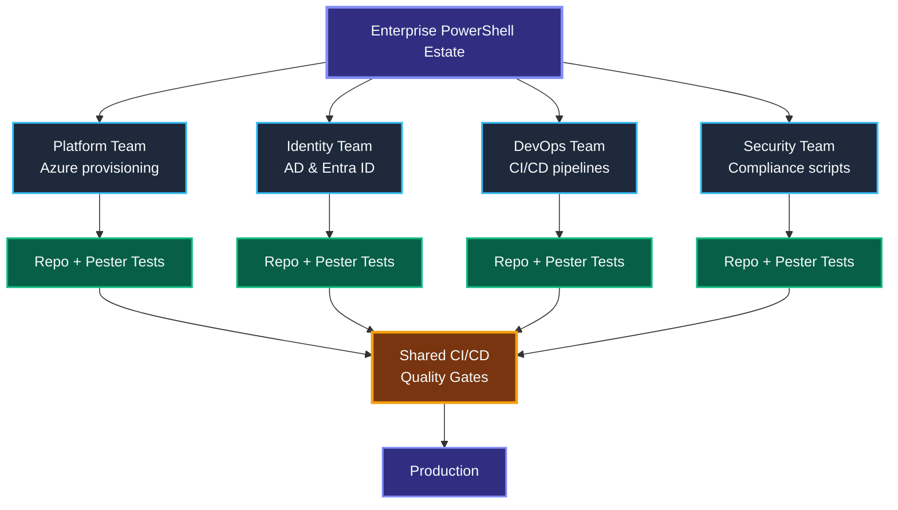
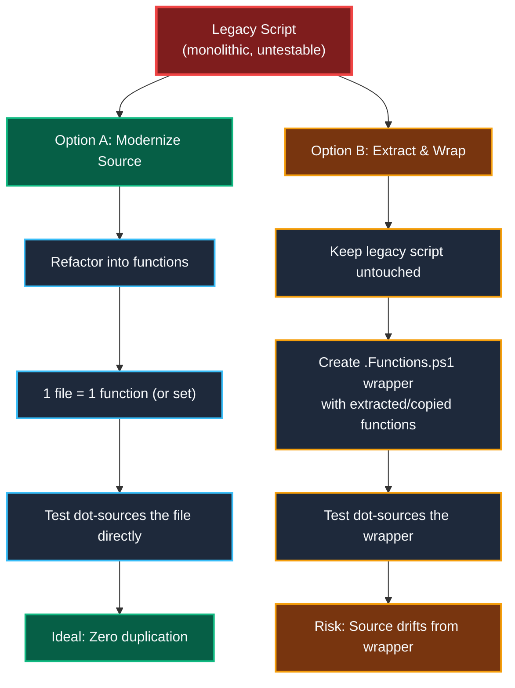
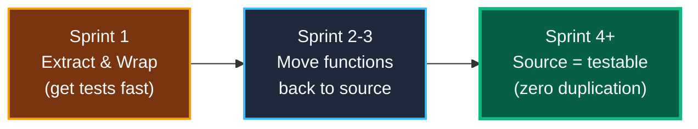
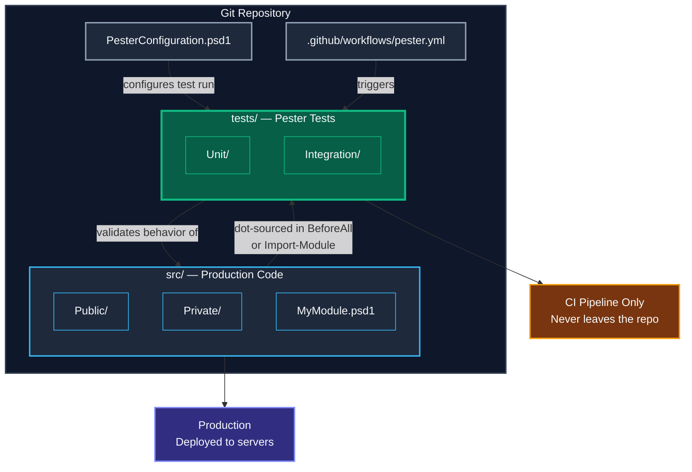
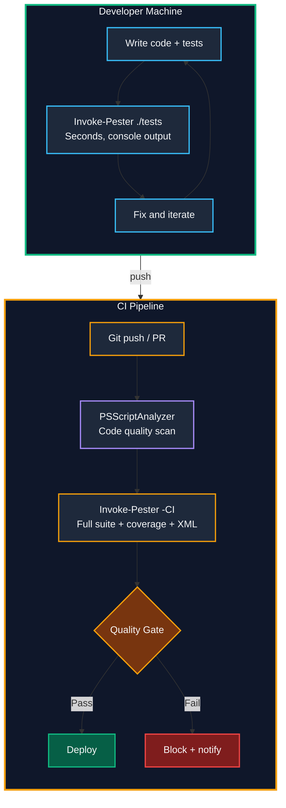

# Enterprise Positioning — Pester Architecture for Large Organizations

> **Agenda:** 11:30–12:00 · Architectural Overview in an Enterprise

---

## The Big Picture — Testing at Enterprise Scale
In a big enterprise, PowerShell scripts are not "just scripts" — they are **infrastructure as code** that provisions Azure resources, configures Active Directory, enforces compliance, and drives CI/CD pipelines. Testing these scripts is not a nice-to-have — it is a **risk control**.


---

## Microsoft's DevOps Test Principles
These principles come from Microsoft's engineering teams and the [Azure Well-Architected Framework](https://learn.microsoft.com/en-us/devops/develop/shift-left-make-testing-fast-reliable). Apply them to your PowerShell testing strategy.

| Principle | What It Means | How Pester Helps |
|---|---|---|
| **Shift left** | Test earlier in the pipeline, not at the end | Run `Invoke-Pester` locally before every commit |
| **Test at the lowest level** | Prefer unit tests over heavy integration tests | Pester's `Mock` lets you test logic without real Azure/AD |
| **Aim for reliability** | Tests must pass consistently, every time | Mocks remove external flakiness (API timeouts, etc.) |
| **Treat test code as product code** | Same code review, same quality bar | Store tests in Git, review in PRs, enforce style with PSScriptAnalyzer |
| **Code owners own their tests** | The person writing the code writes the tests | Tests live in the same repo, same PR |
| **Design for testability** | Write code that is easy to test | Small functions, dependency injection, no hardcoded paths |
| **Use shared test infrastructure** | Standardize across teams | Shared `PesterConfiguration.psd1` template, pinned version |

> *Source: [Microsoft — Shift left to make testing fast & reliable](https://learn.microsoft.com/en-us/devops/develop/shift-left-make-testing-fast-reliable)*
---

## The Legacy Code Problem — Test Strategy for Real Codebases

Most enterprise PowerShell wasn't written with testing in mind. You'll find 500-line scripts that mix logic, Azure calls, user prompts, and `Write-Host` output — all in one file with no functions. **You can't mock what isn't a function.**

### The Two Approaches



### Option A: Modernize the Source (Recommended)

Refactor the script so **every function is in its own file** (or grouped logically). The test dot-sources the source file directly — no intermediate layer.

```
PSCode-Source/02_advanced_functions/
    Azure-Resource-Manager.ps1          ← source (contains the functions)

tests/
    PSCode-02-AdvancedFunctions.Tests.ps1  → dot-sources the .ps1 directly
```

**Pros:** Zero duplication. One source of truth. If the code changes, the tests test the real code.
**Cons:** Requires touching the legacy script. May break existing consumers if the script structure changes.

### Option B: Extract & Wrap (When You Can't Touch Legacy)

Sometimes the legacy script is in production, has no tests, and **nobody wants to refactor it right now**. In that case, create a thin wrapper that copies or imports the testable parts.

```
PSCode-Source/02_advanced_functions/
    Azure-Resource-Manager.ps1           ← legacy (interactive, Write-Host everywhere)
    Azure-Resource-Manager.Functions.ps1 ← extracted functions (testable copy)

tests/
    PSCode-02.Tests.ps1  → dot-sources .Functions.ps1
```

**Pros:** Original script is untouched. You can add tests incrementally without risk.
**Cons:** Duplication. When someone updates the original, the wrapper goes stale — and the tests still pass on old code.

### The Drift Problem

| Scenario | What Happens |
|---|---|
| Developer fixes a bug in the legacy script | Wrapper still has the old buggy code — tests pass on stale logic |
| Developer adds a new parameter | Wrapper doesn't have it — tests never cover the new param |
| Developer changes return type | Wrapper returns the old type — tests are testing dead code |

**This is the real danger of Option B.** The tests give false confidence because they validate a snapshot of old code, not the live code.

### Decision Framework

| Factor | Choose Option A | Choose Option B |
|---|---|---|
| Script is under active development | ✅ Refactor now | |
| Script is in production, high risk | | ✅ Wrap cautiously |
| Team owns the source code | ✅ Modernize it | |
| Script is from another team / vendor | | ✅ Can't touch it |
| Greenfield project | ✅ Always | |
| Regulatory pressure for immediate coverage | | ✅ Quick wins first |

### The Pragmatic Path: Option B → Option A

The best enterprise strategy combines both:

1. **Sprint 1:** Extract functions into a wrapper (Option B) — get test coverage fast.
2. **Sprint 2–3:** Gradually move those functions back into the source script, deleting the wrapper.
3. **Sprint 4+:** Source file IS the testable file. Wrapper deleted. Zero duplication.



### Writing Testable PowerShell — Best Practices

To avoid the legacy problem in the first place, write code that is easy to test from the start:

| Practice | Why It Helps |
|---|---|
| **Put logic in functions, not in the script body** | Functions can be dot-sourced and tested individually |
| **Avoid `Write-Host` inside functions** | Use `Write-Verbose` or `Write-Output` — they are testable |
| **Accept dependencies as parameters** | `param($Logger)` instead of hardcoded `Write-EventLog` — dependency injection |
| **Return objects, not formatted strings** | Tests can assert on properties (`$r.Status`) instead of parsing text |
| **Don't mix logic and side effects** | Separate "decide what to do" from "do it" — test the decision |
| **Use `[CmdletBinding()]` and `param()`** | Enables parameter validation, pipeline input, `-ErrorAction` support |

```powershell
# ❌ Untestable — logic mixed with side effects and Write-Host
$vms = Get-AzVM
foreach ($vm in $vms) {
    if ($vm.PowerState -eq 'Running') { Write-Host "$($vm.Name) is running" }
}

# ✅ Testable — pure function returns data, caller decides output
function Get-RunningVMs {
    param([array]$VMs)
    $VMs | Where-Object { $_.PowerState -eq 'Running' }
}
```
---

## Where Tests Live in Repositories
### Recommended: Separate Folders (Enterprise Standard)

```
my-automation-module/
├── src/
│   ├── Public/
│   │   ├── Get-UserInfo.ps1
│   │   └── Set-Permissions.ps1
│   ├── Private/
│   │   └── Resolve-Identity.ps1
│   └── MyModule.psd1
├── tests/
│   ├── Unit/
│   │   ├── Get-UserInfo.Tests.ps1
│   │   ├── Set-Permissions.Tests.ps1
│   │   └── Resolve-Identity.Tests.ps1
│   └── Integration/
│       └── Module-Import.Tests.ps1
├── .github/
│   └── workflows/
│       └── pester.yml
├── PesterConfiguration.psd1
└── README.md
```

### Alternative: Side-by-Side (Small Projects)

```
scripts/
├── Get-UserInfo.ps1
├── Get-UserInfo.Tests.ps1
├── Set-Permissions.ps1
└── Set-Permissions.Tests.ps1
```

| Aspect | Separate Folders | Side-by-Side |
|---|---|---|
| **Scalability** | Scales to 100+ scripts | Gets messy quickly |
| **CI filtering** | Simple path-based exclusion | Harder to separate |
| **Public/Private split** | Clean module structure | Flat |
| **Enterprise recommendation** | **Yes** | Small utilities only |

> **Rule:** Always use `.Tests.ps1` suffix — Pester discovers tests by this naming convention.
---

## Separation of Production Code and Tests
Tests must **never** ship to production. The boundary is clear:



| What | Where | Deployed? |
|---|---|---|
| **Functions & modules** | `src/Public/`, `src/Private/` | ✅ Yes — to production |
| **Unit tests** | `tests/Unit/*.Tests.ps1` | ❌ No — CI only |
| **Integration tests** | `tests/Integration/*.Tests.ps1` | ❌ No — CI only |
| **Pester config** | `PesterConfiguration.psd1` | ❌ No — repo only |
| **CI workflow** | `.github/workflows/pester.yml` | ❌ No — triggers tests |

**How tests import production code:** dot-source in `BeforeAll` for scripts, or `Import-Module -Force` for modules. Use `-ModuleName` on `Mock` to inject mocks into a module's scope (avoid wrapping tests in `InModuleScope`).

> *Source: [pester.dev — Unit Testing within Modules](https://pester.dev/docs/usage/modules)*
---

## Local Execution vs CI Execution


| Concern | Local Execution | CI Execution |
|---|---|---|
| **Speed** | Seconds — single file/module | Minutes — full suite |
| **Coverage** | Optional, for dev insight | **Enforced** — gates the build |
| **Output** | Console (Detailed verbosity) | XML (NUnit/JUnit) + JaCoCo coverage |
| **Linting** | Optional PSScriptAnalyzer | **Mandatory** before tests run |
| **Purpose** | Fast feedback loop | Quality gate + compliance artifact |

### Enterprise CI Configuration

Use `New-PesterConfiguration` for full control — set `Run.Exit = $true` (non-zero exit on failure), `CodeCoverage.CoveragePercentTarget = 80`, output formats `NUnitXml` + `JaCoCo`, and `Output.CIFormat = 'GithubActions'` for native CI annotations.

> *GitHub Actions workflow and CI/CD integration are covered in **Day 2**.*
---

## Governance and Standardization
In a large enterprise, testing is **governed** — not left to individual preference.


### Enterprise Standardization Checklist

- [ ] All repos use `src/` + `tests/Unit/` + `tests/Integration/` layout
- [ ] Test files follow `<FunctionName>.Tests.ps1` naming
- [ ] CI pipeline includes `Invoke-Pester` with `New-PesterConfiguration`
- [ ] Minimum code coverage threshold set to **80%**
- [ ] PRs cannot merge without passing tests (branch protection)
- [ ] Pester version is pinned in `RequiredModules` or pipeline
- [ ] PSScriptAnalyzer runs before Pester in CI
- [ ] Test results published as NUnit XML artifacts
- [ ] Coverage reports exported as JaCoCo for dashboard integration
- [ ] Shared `PesterConfiguration.psd1` template across all team repos
---

## Well-Architected Testing — Do's and Don'ts
### Do

| Practice | Why |
|---|---|
| **One assertion per `It` block** | Clear failure messages, easy to debug |
| **Use `-ModuleName` on Mock** | Inject mocks into module scope cleanly |
| **Tag tests** (`-Tag 'Unit'`, `'Integration'`) | Run subsets in CI, skip slow tests locally |
| **Use `BeforeAll` for imports** | Code runs in Execution phase, not Discovery |
| **Use `TestDrive:\`** for temp files | Auto-cleaned after each Describe block |
| **Pin Pester version** | Consistent behavior across dev and CI |
| **Use `New-PesterConfiguration`** | Full control over run, coverage, output |
| **Use `$PSScriptRoot`** for paths | Tests work regardless of working directory |
| **Run PSScriptAnalyzer first** | Catch code quality issues before testing |
| **Export test results as XML** | Feed dashboards, audits, compliance tools |

### Don't

| Anti-Pattern | Problem |
|---|---|
| **Logic in Discovery phase** | Code outside `BeforeAll`/`It` runs during scan, causes side effects |
| **`InModuleScope` around Describe** | Slows discovery, hides broken exports |
| **Hardcoded paths** | Tests break on other machines or CI agents |
| **Testing private functions directly** | Couples tests to implementation, not behavior |
| **Skipping tests with `#` comments** | Use `-Skip` parameter instead — tracked in reports |
| **Mocking everything** | Over-mocking hides real bugs — mock only external deps |
| **No `-ErrorAction Stop` on pre-conditions** | Test continues with invalid state |
---

## Gaps, Limitations, and Mitigations
Every tool has boundaries. Understanding Pester's limits helps you architect around them.

| Gap | Detail | Mitigation |
|---|---|---|
| **Binary module mocking** | `Mock -ModuleName` and `InModuleScope` don't work with `.dll` modules | Wrap binary calls in a thin PowerShell function, mock that wrapper |
| **PS class method caching** | Windows PowerShell 5.1 caches class definitions, breaking mocks | Run tests in a fresh session (`Start-Job` or CI runner) |
| **No native parallel execution** | Pester runs tests sequentially | Split suites across parallel CI jobs; use `ForEach-Object -Parallel` |
| **Coverage with breakpoints** | Default breakpoint-based coverage can be slow on large codebases | Set `CodeCoverage.UseBreakpoints = $false` (Profiler-based tracer) |
| **Cross-platform paths** | Hardcoded `C:\` paths break on Linux/macOS | Use `TestDrive:\`, `$PSScriptRoot`, and `Join-Path` |
| **No approval/snapshot testing** | No `Should -MatchSnapshot` equivalent | Use golden-file pattern: compare output to a saved baseline |
| **Limited async/event testing** | Testing async PowerShell is awkward | Isolate async logic into testable functions; mock the event layer |

> *Source: [pester.dev — Modules](https://pester.dev/docs/usage/modules) — "Injecting mocks inside a Binary module is not possible. Exported commands can still be tested and mocked for calls made in script or other modules."*
---

## Complementary Enterprise Tools
Pester is the core — but a well-architected enterprise pairs it with:

| Tool | Purpose | How It Fits |
|---|---|---|
| **PSScriptAnalyzer** | Static analysis / linting | Run before Pester in CI — catches code smells, enforces style |
| **PSRule** | Infrastructure validation rules | Validate ARM/Bicep/Azure policy alongside Pester tests |
| **Plaster** | Project scaffolding templates | Generate new modules with `src/`, `tests/`, Pester config pre-wired |
| **PSake / InvokeBuild** | Build automation | Orchestrate lint → test → coverage → publish in one build script |
| **GitHub Actions / Azure Pipelines** | CI/CD | Run Pester, publish NUnit results, enforce quality gates |
| **Codecov / SonarQube** | Coverage dashboards | Consume JaCoCo coverage XML from Pester |
| **GitHub Copilot** | AI-assisted test generation | Scaffold Pester tests from function signatures (Day 2 topic) |
---

## Key Test Metrics for Enterprise Reporting
| Metric | Target | Why It Matters |
|---|---|---|
| **Pass rate** | 100% on `main` | Broken tests = blocked deployments |
| **Code coverage** | 80%+ per module | Untested code is risky in production |
| **Test count** | Growing with each PR | More tests = more confidence |
| **Execution time** | < 30s for unit suite | Slow suites discourage running tests |
| **Flaky rate** | 0% | Intermittent failures erode team trust |
| **Test-to-code ratio** | 1:1 or higher | Every function has at least one test |
| **Mean time to resolve** | < 1 day | How fast broken tests get fixed |

> *Microsoft teams track these metrics on scorecards. One team runs 60,000 unit tests in parallel in under 6 minutes.* ([source](https://learn.microsoft.com/en-us/devops/develop/shift-left-make-testing-fast-reliable))

> *Pester supports NUnit 2.5, JUnit 4, and JaCoCo output formats for CI dashboard integration.* ([source](https://pester.dev/docs/usage/test-results))
---

## Enterprise Maturity Model
Where does your team sit today?

| Level | Name | Characteristics |
|---|---|---|
| **0** | No Testing | Scripts run manually, "works on my machine" |
| **1** | Ad Hoc | Some `.Tests.ps1` files, not in CI |
| **2** | Consistent | All modules have tests, CI runs Pester, but no coverage gates |
| **3** | Governed | Coverage thresholds enforced, PSScriptAnalyzer mandatory, test reports published |
| **4** | Optimized | Parallel test runs, AI-assisted test generation, flaky test tracking, test health dashboards |


**Workshop goal: Move every team to at least Level 3.**
---

## Key Takeaways
1. **Tests are first-class** — they live in version control, structured under `tests/Unit/` and `tests/Integration/`.
2. **Separate but connected** — `src/` for production code, `tests/` for Pester, linked via dot-sourcing or `Import-Module`.
3. **Shift left** — developers run Pester locally for seconds-fast feedback; CI enforces quality gates.
4. **Standardize across teams** — naming, folder structure, coverage thresholds, Pester version, PSScriptAnalyzer rules.
5. **Know the gaps** — binary module mocking, class caching, no parallel execution; architect around them.
6. **Complementary tooling** — PSScriptAnalyzer for linting, PSRule for infra validation, Plaster for scaffolding.
7. **Measure and report** — pass rate, coverage, flaky rate, MTTR — make testing health visible to leadership.

### Further Reading

| Resource | Link |
|---|---|
| Microsoft Shift-Left Testing | [learn.microsoft.com — shift-left-make-testing-fast-reliable](https://learn.microsoft.com/en-us/devops/develop/shift-left-make-testing-fast-reliable) |
| Pester Modules Testing | [pester.dev/docs/usage/modules](https://pester.dev/docs/usage/modules) |
| Pester Code Coverage | [pester.dev/docs/usage/code-coverage](https://pester.dev/docs/usage/code-coverage) |
| Pester CI Test Results | [pester.dev/docs/usage/test-results](https://pester.dev/docs/usage/test-results) |

---

> *Next → Lunch Break (12:00) · Then → Mocking & Test Isolation (13:00)*