# Enterprise Positioning — Pester Architecture for Large Organizations

> **Agenda:** 11:30–12:00 · Architectural Overview in an Enterprise

---

## The Big Picture — Testing at Enterprise Scale

In a billion-euro enterprise, PowerShell scripts are not "just scripts" — they are **infrastructure as code** that provisions Azure resources, configures Active Directory, enforces compliance, and drives CI/CD pipelines. Testing these scripts is not a nice-to-have — it is a **risk control**.

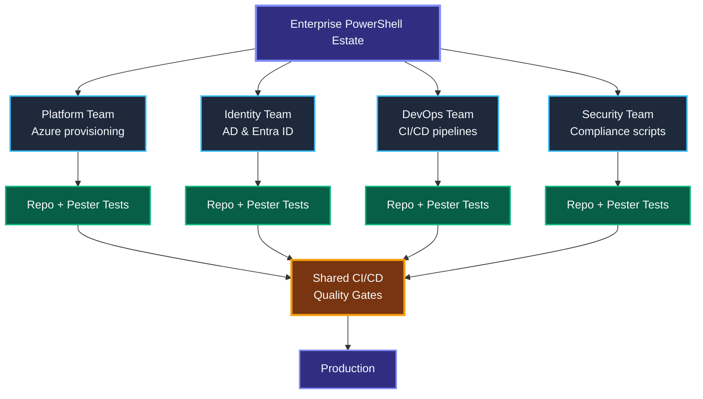

---

## Where Tests Live in Repositories

### Recommended: Separate Folders (Enterprise Standard)

```
my-automation-module/
├── src/
│   ├── Public/
│   │   ├── Get-UserInfo.ps1
│   │   └── Set-Permissions.ps1
│   ├── Private/
│   │   └── Resolve-Identity.ps1
│   └── MyModule.psd1
├── tests/
│   ├── Unit/
│   │   ├── Get-UserInfo.Tests.ps1
│   │   ├── Set-Permissions.Tests.ps1
│   │   └── Resolve-Identity.Tests.ps1
│   └── Integration/
│       └── Module-Import.Tests.ps1
├── .github/
│   └── workflows/
│       └── pester.yml
├── PesterConfiguration.psd1
└── README.md
```

### Alternative: Side-by-Side (Small Projects)

```
scripts/
├── Get-UserInfo.ps1
├── Get-UserInfo.Tests.ps1
├── Set-Permissions.ps1
└── Set-Permissions.Tests.ps1
```

| Aspect | Separate Folders | Side-by-Side |
|---|---|---|
| **Scalability** | Scales to 100+ scripts | Gets messy quickly |
| **CI filtering** | Simple path-based exclusion | Harder to separate |
| **Public/Private split** | Clean module structure | Flat |
| **Enterprise recommendation** | **Yes** | Small utilities only |

> **Rule:** Always use `.Tests.ps1` suffix — Pester discovers tests by this naming pattern. `Run.TestExtension` defaults to `.Tests.ps1`.

---

## Separation of Production Code and Tests

Tests must **never** ship to production. The boundary is clear:

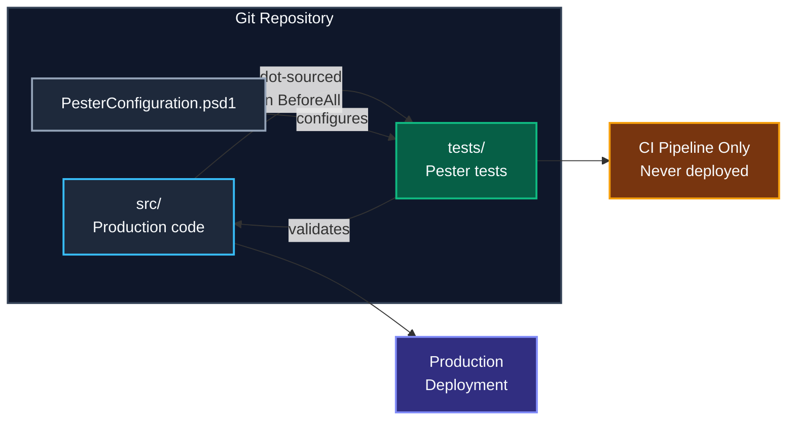

**How tests import production code:**

```powershell
# For standalone scripts
BeforeAll {
    . $PSScriptRoot/../src/Public/Get-UserInfo.ps1
}

# For modules — preferred at enterprise scale
BeforeAll {
    Import-Module $PSScriptRoot/../src/MyModule.psd1 -Force
}
```

**Testing module internals** — use `-ModuleName` on `Mock` instead of wrapping everything in `InModuleScope`:

```powershell
# Preferred — mock into the module scope
Mock -ModuleName MyModule Get-ADUser { return @{ Name = 'Jane' } }

# Avoid — InModuleScope around Describe/It blocks
# (slows discovery, hides publishing issues)
```

---

## Local Execution vs CI Execution

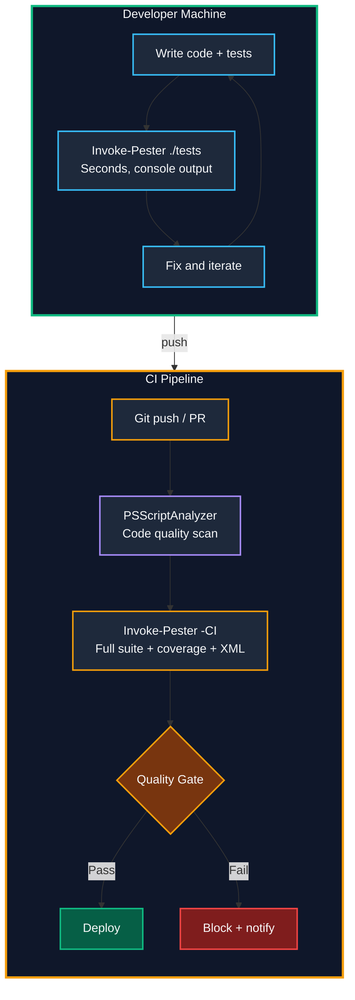

| Concern | Local Execution | CI Execution |
|---|---|---|
| **Speed** | Seconds — single file/module | Minutes — full suite |
| **Coverage** | Optional, for dev insight | **Enforced** — gates the build |
| **Output** | Console (Detailed verbosity) | XML (NUnit/JUnit) + JaCoCo coverage |
| **Linting** | Optional PSScriptAnalyzer | **Mandatory** before tests run |
| **Purpose** | Fast feedback loop | Quality gate + compliance artifact |

### Enterprise CI Configuration (New-PesterConfiguration)

```powershell
$config = New-PesterConfiguration
$config.Run.Path            = './tests'
$config.Run.Exit            = $true                  # Non-zero exit on failure
$config.CodeCoverage.Enabled = $true
$config.CodeCoverage.Path    = './src'
$config.CodeCoverage.CoveragePercentTarget = 80       # Enterprise threshold
$config.CodeCoverage.OutputFormat = 'JaCoCo'          # Standard CI format
$config.TestResult.Enabled   = $true
$config.TestResult.OutputFormat = 'NUnitXml'          # Publish to dashboards
$config.Output.Verbosity     = 'Detailed'
$config.Output.CIFormat      = 'GithubActions'        # Native CI annotations

Invoke-Pester -Configuration $config
```

---

## Governance and Standardization

In a large enterprise, testing is **governed** — not left to individual preference.

```mermaid
graph TB
    GOV["Enterprise Test Governance"]

    GOV --> STD["Standards"]
    GOV --> ENFORCE["Enforcement"]
    GOV --> REPORT["Reporting"]

    STD --> NAMING["Naming Convention\n*.Tests.ps1"]
    STD --> STRUCTURE["Folder Structure\nsrc/ + tests/"]
    STD --> VERSION["Pester Version Pinned\ne.g. 5.7.1"]
    STD --> LINT["PSScriptAnalyzer Rules\nEnforced in CI"]

    ENFORCE --> PR["PR Policy\nTests required to merge"]
    ENFORCE --> GATE["Quality Gate\n80%+ coverage, 0 failures"]
    ENFORCE --> BRANCH["Branch Protection\nNo direct push to main"]

    REPORT --> DASH["Test Dashboards\nPass rate, coverage trends"]
    REPORT --> AUDIT["Compliance Artifacts\nXML reports for auditors"]
    REPORT --> ALERT["Alerting\nNotify on regressions"]

    style GOV fill:#312e81,stroke:#818cf8,color:#f8fafc,stroke-width:3px
    style STD fill:#1e293b,stroke:#38bdf8,color:#f8fafc,stroke-width:2px
    style ENFORCE fill:#1e293b,stroke:#f59e0b,color:#f8fafc,stroke-width:2px
    style REPORT fill:#1e293b,stroke:#10b981,color:#f8fafc,stroke-width:2px
    style NAMING fill:#1e293b,stroke:#94a3b8,color:#f8fafc,stroke-width:2px
    style STRUCTURE fill:#1e293b,stroke:#94a3b8,color:#f8fafc,stroke-width:2px
    style VERSION fill:#1e293b,stroke:#94a3b8,color:#f8fafc,stroke-width:2px
    style LINT fill:#1e293b,stroke:#94a3b8,color:#f8fafc,stroke-width:2px
    style PR fill:#1e293b,stroke:#94a3b8,color:#f8fafc,stroke-width:2px
    style GATE fill:#1e293b,stroke:#94a3b8,color:#f8fafc,stroke-width:2px
    style BRANCH fill:#1e293b,stroke:#94a3b8,color:#f8fafc,stroke-width:2px
    style DASH fill:#1e293b,stroke:#94a3b8,color:#f8fafc,stroke-width:2px
    style AUDIT fill:#1e293b,stroke:#94a3b8,color:#f8fafc,stroke-width:2px
    style ALERT fill:#1e293b,stroke:#94a3b8,color:#f8fafc,stroke-width:2px
```

### Enterprise Standardization Checklist

- [ ] All repos use `src/` + `tests/Unit/` + `tests/Integration/` layout
- [ ] Test files follow `<FunctionName>.Tests.ps1` naming
- [ ] CI pipeline includes `Invoke-Pester` with `New-PesterConfiguration`
- [ ] Minimum code coverage threshold set to **80%** (`CodeCoverage.CoveragePercentTarget`)
- [ ] PRs cannot merge without passing tests (branch protection)
- [ ] Pester version is pinned (e.g., `5.7.1`) in `RequiredModules` or pipeline
- [ ] PSScriptAnalyzer runs before Pester in CI
- [ ] Test results published as NUnit XML artifacts
- [ ] Coverage reports exported as JaCoCo for dashboard integration
- [ ] Shared `PesterConfiguration.psd1` template across all team repos

---

## Well-Architected Testing — Best Practices

### Do

| Practice | Why |
|---|---|
| **One assertion per `It` block** | Clear failure messages, easy to debug |
| **Use `-ModuleName` on Mock** | Inject mocks into module scope cleanly |
| **Tag tests** (`-Tag 'Unit'`, `'Integration'`) | Run subsets in CI, skip slow tests locally |
| **Use `BeforeAll` for imports** | Code runs in Execution phase, not Discovery |
| **Use `TestDrive:\`** for temp files | Auto-cleaned after each Describe block |
| **Pin Pester version** | Consistent behavior across dev and CI |
| **Use `New-PesterConfiguration`** | Full control over run, coverage, output |
| **Use `$PSScriptRoot`** for paths | Tests work regardless of working directory |
| **Run PSScriptAnalyzer first** | Catch code quality issues before testing |
| **Export test results as XML** | Feed dashboards, audits, compliance tools |

### Don't

| Anti-Pattern | Problem |
|---|---|
| **Logic in Discovery phase** | Code outside `BeforeAll`/`It` runs during scan, causes side effects |
| **`InModuleScope` around Describe** | Slows discovery, hides broken exports |
| **Hardcoded paths** | Tests break on other machines or CI agents |
| **Testing private functions directly** | Couples tests to implementation, not behavior |
| **Skipping tests with `#` comments** | Use `-Skip` parameter instead — tracked in reports |
| **Mocking everything** | Over-mocking hides real bugs — mock only external deps |
| **No `-ErrorAction Stop` on pre-conditions** | Test continues with invalid state |

---

## Gaps, Limitations, and Mitigations

Every tool has boundaries. Understanding Pester's limitations helps you architect around them.

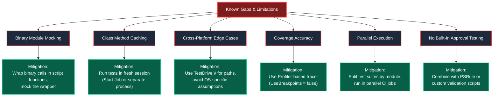

| Gap | Detail | Mitigation |
|---|---|---|
| **Binary module mocking** | `Mock -ModuleName` and `InModuleScope` do not work with binary (`.dll`) modules | Wrap binary calls in a thin PowerShell function, mock that function |
| **PS class method caching** | Windows PowerShell 5.1 caches class definitions, breaking mocks across runs | Run tests in a fresh session (`Start-Job` or CI runner) |
| **No native parallel execution** | Pester runs tests sequentially within a single process | Split suites across parallel CI jobs; use `ForEach-Object -Parallel` to invoke separate Pester runs |
| **Coverage with breakpoints** | Default breakpoint-based coverage can be slow on large codebases | Set `CodeCoverage.UseBreakpoints = $false` to use the Profiler-based tracer (experimental but faster) |
| **Cross-platform paths** | Hardcoded `C:\` paths break on Linux/macOS runners | Use `TestDrive:\`, `$PSScriptRoot`, and `Join-Path` |
| **No built-in approval/snapshot testing** | Pester has no `Should -MatchSnapshot` equivalent | Use golden-file pattern: compare output to a saved baseline file |
| **Limited async/event testing** | Testing event-driven or async PowerShell is awkward | Isolate async logic into testable functions; mock the event layer |

---

## Complementary Enterprise Tools

Pester is the core — but a well-architected enterprise pairs it with:

| Tool | Purpose | How It Fits |
|---|---|---|
| **PSScriptAnalyzer** | Static analysis / linting | Run before Pester in CI — catches code smells, enforces style |
| **PSRule** | Infrastructure validation rules | Validate ARM/Bicep/Azure policy alongside Pester tests |
| **Plaster** | Project scaffolding templates | Generate new modules with `src/`, `tests/`, Pester config pre-wired |
| **PSake / InvokeBuild** | Build automation | Orchestrate lint → test → coverage → publish in one build script |
| **GitHub Actions / Azure Pipelines** | CI/CD | Run Pester, publish NUnit results, enforce quality gates |
| **Codecov / SonarQube** | Coverage dashboards | Consume JaCoCo coverage XML from Pester |
| **GitHub Copilot** | AI-assisted test generation | Scaffold Pester tests from function signatures (Day 2 topic) |

---

## Key Test Metrics for Enterprise Reporting

Track these metrics to measure testing health across your organization:

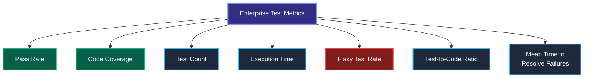

| Metric | Target | Why It Matters |
|---|---|---|
| **Pass rate** | 100% on `main` | Broken tests = blocked deployments |
| **Code coverage** | 80%+ per module | Untested code is risky in production |
| **Test count** | Growing with each PR | More tests = more confidence |
| **Execution time** | < 30s for unit suite | Slow suites discourage running tests |
| **Flaky rate** | 0% | Intermittent failures erode team trust |
| **Test-to-code ratio** | 1:1 or higher | Every function has at least one test |
| **Mean time to resolve** | < 1 day | How fast broken tests get fixed |

### Generating Reports for Dashboards

```powershell
$config = New-PesterConfiguration
$config.TestResult.Enabled      = $true
$config.TestResult.OutputFormat  = 'NUnitXml'         # For CI dashboards
$config.TestResult.OutputPath    = './testResults.xml'
$config.CodeCoverage.Enabled     = $true
$config.CodeCoverage.OutputFormat = 'JaCoCo'           # For Codecov/SonarQube
$config.CodeCoverage.OutputPath  = './coverage.xml'

Invoke-Pester -Configuration $config
```

---

## Enterprise Maturity Model

Where does your team sit today?

| Level | Name | Characteristics |
|---|---|---|
| **0** | No Testing | Scripts run manually, "works on my machine" |
| **1** | Ad Hoc | Some `.Tests.ps1` files, not in CI |
| **2** | Consistent | All modules have tests, CI runs Pester, but no coverage gates |
| **3** | Governed | Coverage thresholds enforced, PSScriptAnalyzer mandatory, test reports published |
| **4** | Optimized | Parallel test runs, AI-assisted test generation, flaky test tracking, test health dashboards |

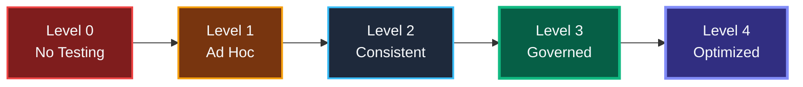

**Workshop goal: Move every team to at least Level 3.**

---

## Key Takeaways

1. **Tests are first-class** — they live in version control, structured under `tests/Unit/` and `tests/Integration/`.
2. **Separate but connected** — `src/` for production code, `tests/` for Pester, linked via dot-sourcing or `Import-Module`.
3. **Local + CI** — developers run Pester locally for seconds-fast feedback; CI enforces quality gates and produces compliance artifacts.
4. **Standardize across teams** — naming, folder structure, coverage thresholds, Pester version, PSScriptAnalyzer rules.
5. **Know the gaps** — binary module mocking, class caching, no parallel execution; architect around them.
6. **Complementary tooling** — PSScriptAnalyzer for linting, PSRule for infrastructure validation, Plaster for scaffolding, Codecov for dashboards.
7. **Measure and report** — pass rate, coverage, flaky rate, MTTR — make testing health visible to leadership.

---

> *Next → Lunch Break (12:00) · Then → Mocking & Test Isolation (13:00)*
# Enterprise Positioning — Pester in Your Organization

> **Agenda slots covered:** 10:30–11:30 Pester Fundamentals (Deep Dive) + 11:30–12:00 Architectural Overview in an Enterprise

---

## How an Enterprise Test Setup Looks

In a mature enterprise, tests are **first-class citizens** — they live alongside production code, run automatically, and gate every deployment.

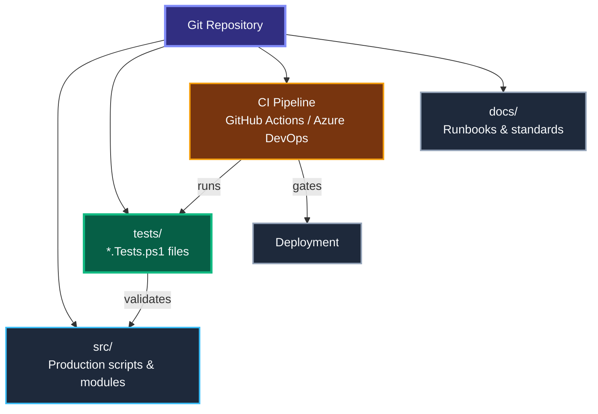

---

## Where Tests Live in Repositories

There are two common patterns. Both work — pick one and **stay consistent** across teams.

### Pattern A — Side-by-Side

```
project/
├── Get-UserInfo.ps1
├── Get-UserInfo.Tests.ps1      ← test next to source
├── Set-Permissions.ps1
└── Set-Permissions.Tests.ps1
```

### Pattern B — Separate Folders

```
project/
├── src/
│   ├── Get-UserInfo.ps1
│   └── Set-Permissions.ps1
└── tests/
    ├── Get-UserInfo.Tests.ps1
    └── Set-Permissions.Tests.ps1
```

| Aspect | Side-by-Side | Separate Folders |
|---|---|---|
| **Discoverability** | Easy — file is right there | Need to navigate |
| **CI filtering** | Harder to exclude tests | Simple path-based filter |
| **Enterprise preference** | Small projects | Larger codebases |

> **Convention:** Always use the `.Tests.ps1` suffix — Pester discovers tests by this naming pattern.

---

## Separation of Production Code and Tests

Tests should **never** ship to production. Keep them isolated.

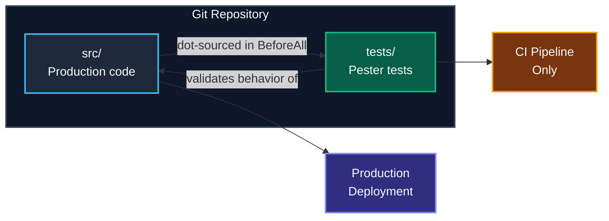

**How tests import production code:**

```powershell
BeforeAll {
    . $PSScriptRoot/../src/Get-UserInfo.ps1
}
```

This `dot-sources` the function into the test scope without bundling test code into production.

---

## Local Execution vs CI Execution

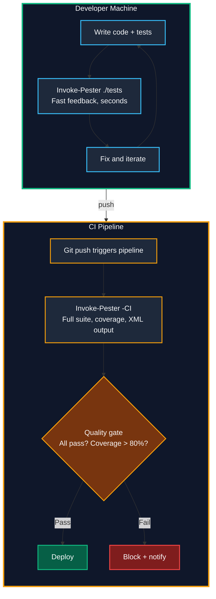

| Concern | Local | CI |
|---|---|---|
| **Speed** | Seconds — run single file | Minutes — full suite |
| **Coverage** | Optional | Enforced |
| **Output** | Console | XML + published reports |
| **Purpose** | Fast feedback loop | Quality gate |

---

## Governance and Standardization

In an enterprise, testing is not optional — it is **governed**.

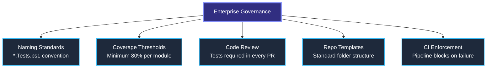

### Standardization Checklist

- [ ] All repos use `src/` + `tests/` folder layout
- [ ] Test files follow `<FunctionName>.Tests.ps1` naming
- [ ] CI pipeline includes `Invoke-Pester -CI`
- [ ] Minimum code coverage threshold is defined
- [ ] PRs cannot merge without passing tests
- [ ] Pester version is pinned (e.g., `5.7.1`) across teams

---

## Pester Test Structure — Deep Dive

### The Building Blocks

Every Pester test is built from four core constructs:

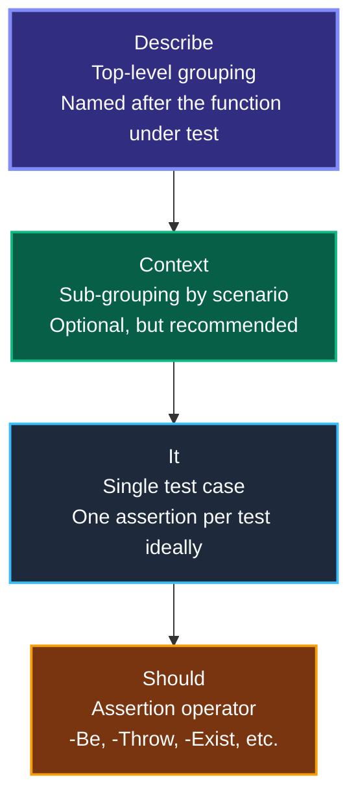

### Full Structure with Setup/Teardown

```powershell
Describe 'Get-UserInfo' {

    BeforeAll {
        # Runs ONCE before all tests in this Describe
        . $PSScriptRoot/../src/Get-UserInfo.ps1
    }

    AfterAll {
        # Runs ONCE after all tests — cleanup
    }

    Context 'When user exists' {

        BeforeEach {
            # Runs before EVERY It in this Context
            Mock Get-ADUser { return @{ Name = 'Jane' } }
        }

        It 'Returns the user name' {
            $result = Get-UserInfo -UserId 'jane01'
            $result.Name | Should -Be 'Jane'
        }

        It 'Does not return null' {
            $result = Get-UserInfo -UserId 'jane01'
            $result | Should -Not -BeNullOrEmpty
        }
    }

    Context 'When user does not exist' {

        BeforeEach {
            Mock Get-ADUser { return $null }
        }

        It 'Returns null' {
            $result = Get-UserInfo -UserId 'ghost'
            $result | Should -BeNullOrEmpty
        }
    }
}
```

### Setup & Teardown — When Each Runs


| Block | Runs | Use Case |
|---|---|---|
| `BeforeAll` | Once per Describe/Context | Import modules, dot-source functions |
| `BeforeEach` | Before every `It` | Set up mocks, reset state |
| `It` | The test itself | One assertion per test |
| `AfterEach` | After every `It` | Clean up per-test artifacts |
| `AfterAll` | Once per Describe/Context | Clean up shared resources |

---

## Common Assertion Operators

| Operator | What it checks | Example |
|---|---|---|
| `Should -Be` | Equality (case-insensitive) | `$x \| Should -Be 5` |
| `Should -BeExactly` | Equality (case-sensitive) | `$x \| Should -BeExactly 'Hello'` |
| `Should -BeNullOrEmpty` | Null or empty | `$x \| Should -BeNullOrEmpty` |
| `Should -Not -Be` | Inequality | `$x \| Should -Not -Be 0` |
| `Should -BeGreaterThan` | Greater than | `$x \| Should -BeGreaterThan 10` |
| `Should -Exist` | File/path exists | `'C:\log.txt' \| Should -Exist` |
| `Should -Throw` | Throws an exception | `{ Bad-Func } \| Should -Throw` |
| `Should -HaveCount` | Collection count | `$arr \| Should -HaveCount 3` |
| `Should -Invoke` | Mock was called | `Should -Invoke Get-ADUser -Times 1` |

---

## Test Discovery and Execution

Pester operates in **two phases**:

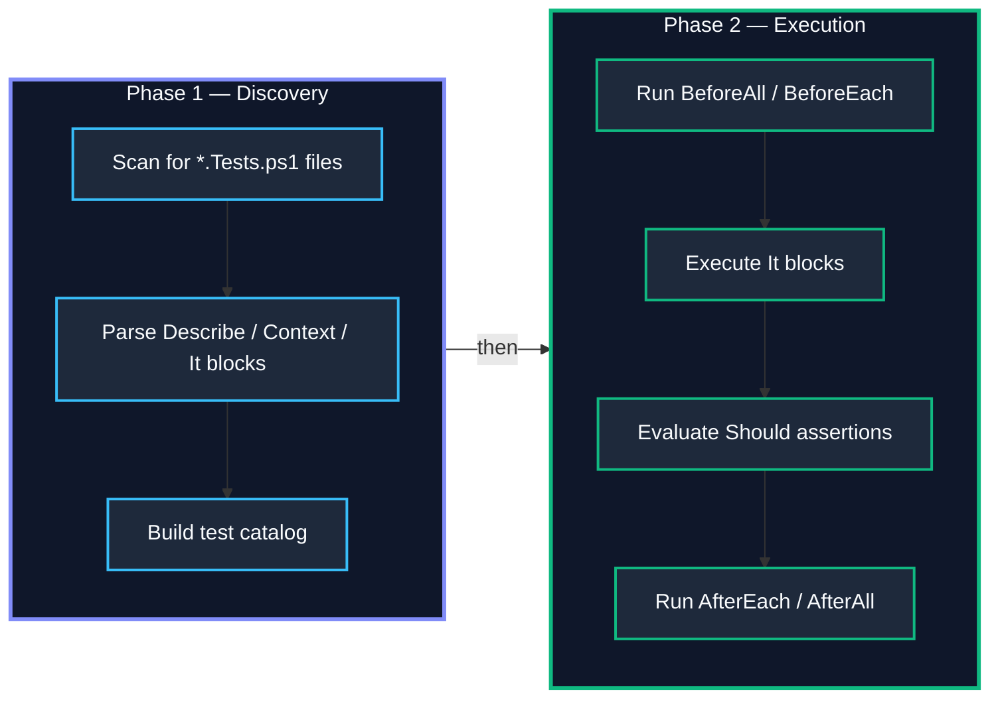

**Why this matters:**
- Code in `Describe`/`Context` blocks (outside `BeforeAll`, `It`, etc.) runs during **Discovery** — don't put logic there.
- Code in `BeforeAll`, `BeforeEach`, `It` runs during **Execution** — this is where your logic belongs.

---

## Local Execution and Tooling Support

### Running Tests from the Terminal

```powershell
# Run all tests in a folder
Invoke-Pester ./tests

# Run with detailed output
Invoke-Pester ./tests -Output Detailed

# Run a specific test file
Invoke-Pester ./tests/Get-UserInfo.Tests.ps1

# Run with code coverage
Invoke-Pester ./tests -CodeCoverage ./src/*.ps1

# Run in CI mode (exit code + XML output + coverage)
Invoke-Pester -CI
```

### VS Code Integration

Pester integrates with VS Code out of the box:

- **Test Explorer** — discover and run tests from the sidebar
- **Inline results** — green/red indicators next to `It` blocks
- **Debug tests** — set breakpoints inside test code and step through
- **PowerShell extension** — syntax highlighting and IntelliSense for Pester keywords

---

## Key Test Metrics

Track these metrics to measure testing health across your enterprise:

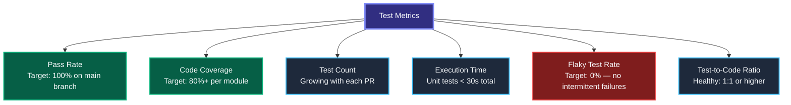

| Metric | What It Measures | Target | Why It Matters |
|---|---|---|---|
| **Pass rate** | % of tests passing | 100% on main | Broken tests = broken builds |
| **Code coverage** | % of lines executed by tests | 80%+ | Untested code is risky code |
| **Test count** | Number of test cases | Growing | More tests = more confidence |
| **Execution time** | How long the suite takes | < 30s for units | Slow tests discourage running them |
| **Flaky rate** | Tests that sometimes pass/fail | 0% | Flaky tests erode trust |
| **Test-to-code ratio** | Tests per function/module | 1:1 or higher | Ensures nothing is untested |

---

## Key Takeaways

1. **Tests are first-class** — they live in version control, right next to production code.
2. **Separate but connected** — `src/` for code, `tests/` for tests, linked via `dot-sourcing`.
3. **Local + CI** — developers run Pester locally for fast feedback; CI enforces quality gates.
4. **Standardize everything** — naming, folder structure, coverage thresholds, Pester version.
5. **Describe → Context → It → Should** — the four building blocks of every Pester test.
6. **Discovery then Execution** — Pester scans first, runs second — keep logic in the right phase.
7. **Measure what matters** — pass rate, coverage, execution time, flaky rate.

---

> *Next → Mocking & Test Isolation (13:00)*
