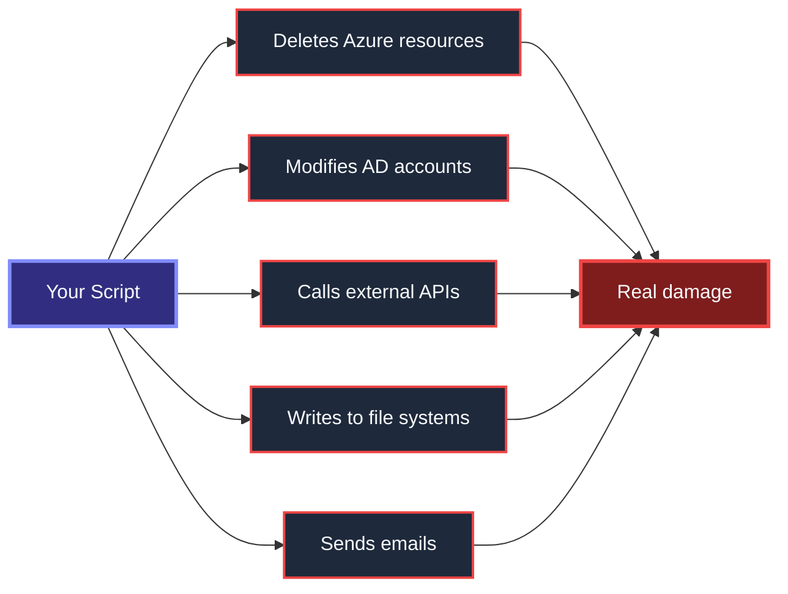
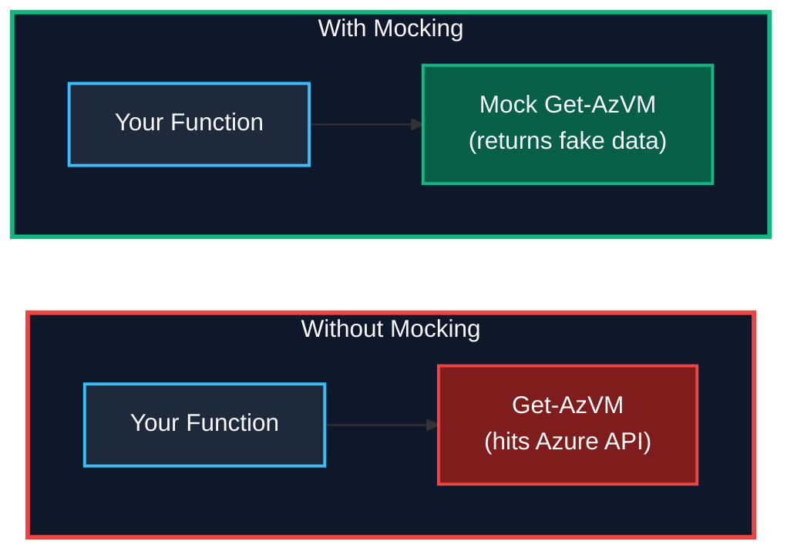
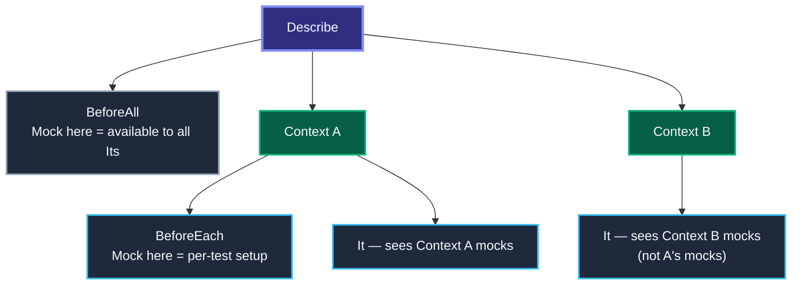
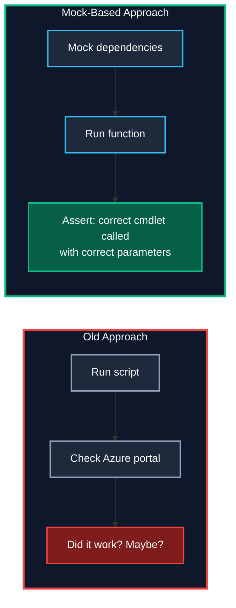

# Mocking & Test Isolation

> **Agenda:** 13:00–13:30 · 30-minute session · Day 1

---

## The Problem — Why You Can't Just Run the Code
Infrastructure scripts interact with **real systems**. Running them in a test means:



**You need a way to test logic without triggering side effects.** That's mocking.
---

## What Is Mocking?
Mocking replaces a real command with a **fake implementation** during a test. The fake returns controlled data so you can test your logic — not the dependency.



### Mocks vs Stubs vs Fakes

These terms are often used interchangeably, but they have subtle differences:

| Term | Definition | Pester Equivalent |
|---|---|---|
| **Mock** | Replaces a command AND lets you verify it was called | `Mock` + `Should -Invoke` |
| **Stub** | Replaces a command with a fixed return value (no verification) | `Mock Get-Date { '2025-01-01' }` (without `Should -Invoke`) |
| **Fake** | A working but simplified implementation | `Mock Get-AzVM { return @{ Status = 'Running' } }` |

> *In Pester, all three are created with `Mock`. The difference is whether you also call `Should -Invoke`.  
> See: [Martin Fowler — Mocks Aren't Stubs](https://martinfowler.com/articles/mocksArentStubs.html)*
---

## Pester Mocking — The Two Commands
| Command | Purpose |
|---|---|
| `Mock` | Replace a command with a fake |
| `Should -Invoke` | Verify the mock was called (or not) |

### Basic Pattern (AAA)

```powershell
Describe 'Remove-OldBackups' {                    # Group tests for this function
    BeforeAll {
        . $PSScriptRoot/../src/Remove-OldBackups.ps1  # Import the function to test
    }

    It 'Deletes files older than 30 days' {
        # ARRANGE — replace the dangerous command with a fake that does nothing
        Mock Remove-Item {}                           # {} = empty body, no file deletion happens

        # ACT — run the function (it calls Remove-Item internally)
        Remove-OldBackups -Days 30

        # ASSERT — verify the mock was called exactly once
        Should -Invoke Remove-Item -Times 1 -Exactly  # Proves the function tried to delete
    }
}
```

**Nothing was deleted.** The mock intercepted `Remove-Item` and did nothing. But you proved your function *called* it.
---

## Real-World Enterprise Examples
### Mocking Azure Cmdlets

```powershell
Describe 'Get-VMStatus' {
    BeforeAll {
        . $PSScriptRoot/../src/Get-VMStatus.ps1       # Import function under test
    }

    Context 'When VM is running' {                     # Scenario: VM exists and is active
        It 'Returns Running status' {
            Mock Get-AzVM {                            # Replace real Azure call with fake
                return @{ PowerState = 'VM running' }  # Fake return data
            }

            $result = Get-VMStatus -VMName 'prod-web-01'   # Call the function (uses mock)
            $result | Should -Be 'Running'                  # Assert return value
            Should -Invoke Get-AzVM -Times 1                # Verify mock was called once
        }
    }

    Context 'When VM does not exist' {                 # Scenario: VM not found in Azure
        It 'Returns $null' {
            Mock Get-AzVM { return $null }             # Mock returns nothing

            $result = Get-VMStatus -VMName 'ghost-vm'
            $result | Should -BeNullOrEmpty            # Assert null return
        }
    }
}
```

### Mocking REST API Calls

```powershell
Describe 'Get-WeatherAlert' {
    BeforeAll {
        . $PSScriptRoot/../src/Get-WeatherAlert.ps1    # Import function
    }

    It 'Parses API response correctly' {
        Mock Invoke-RestMethod {                       # Replace real HTTP call with fake
            return @{ alerts = @(@{ severity = 'High' }) }  # Fake JSON response
        }

        $result = Get-WeatherAlert -City 'Ludwigshafen'     # Function calls Invoke-RestMethod internally
        $result.severity | Should -Be 'High'                 # Assert parsed value
        Should -Invoke Invoke-RestMethod -Times 1            # Verify API was "called" once
    }
}
```

### Mocking Active Directory

```powershell
Describe 'Disable-InactiveUsers' {
    It 'Disables users not logged in for 90 days' {
        Mock Get-ADUser {                              # Replace real AD query with fake
            return @(
                @{ SamAccountName = 'jdoe'; LastLogonDate = (Get-Date).AddDays(-100) }  # 100 days ago
            )
        }
        Mock Disable-ADAccount {}

        Disable-InactiveUsers -Days 90

        Should -Invoke Disable-ADAccount -Times 1
    }
}
```

### Mocking Native Applications (git, curl, etc.)

Pester can mock **native executables** like `git.exe` — same `Mock` syntax. Use `$args` to detect subcommands.

> *Source: [pester.dev — Mocking native applications](https://pester.dev/docs/usage/mocking)*

```powershell
Describe 'Test-GitEnvironment' {
    BeforeAll {
        Mock git {
            switch ($args[0]) {
                '--version' { return 'git version 2.44.0' }
                'config'    {
                    if ($args[1] -eq 'user.name') { return 'Workshop User' }
                }
                'rev-parse' { return 'true' }
            }
        }
    }

    It 'Detects Git is installed' {
        (Test-GitEnvironment).GitInstalled | Should -Be $true
    }
}
```
---

## Mock Scoping — Where Mocks Live
Mocks are scoped to the block where they are defined. This is a **Pester 5 change** from v4.



```powershell
Describe 'Scoping demo' {
    BeforeAll {
        Mock Get-Date { return '2025-01-01' }   # Available everywhere in this Describe
    }

    Context 'Scenario A' {
        BeforeEach {
            Mock Get-Service { return @{ Status = 'Running' } }
        }
        It 'Sees both mocks' {
            Get-Date     | Should -Be '2025-01-01'
            (Get-Service).Status | Should -Be 'Running'
        }
    }

    Context 'Scenario B' {
        It 'Sees only BeforeAll mock' {
            Get-Date | Should -Be '2025-01-01'
            # Get-Service is NOT mocked here — it would call the real cmdlet
        }
    }
}
```

### Pester 5 Scoping Rules (Changed from v4)

| Behavior | Pester 4 | Pester 5 |
|---|---|---|
| Mock scope | Entire Describe/Context where defined | Only the block where defined |
| `Should -Invoke` counting | Global to Describe | Scoped to the current `It` by default |
| Override `-Scope` | Not needed | Use `-Scope Describe` to count across all Its |
| Parameter filters | Required `param()` | No `param()` needed |

> *Source: [pester.dev — Changes from Pester v4](https://pester.dev/docs/usage/mocking#changes-from-pester-v4)*
---

## ParameterFilter — Conditional Mocks
Return different results based on input:

```powershell
Mock Get-AzVM {
    return @{ Name = 'prod-web'; Status = 'Running' }
} -ParameterFilter { $Name -eq 'prod-web' }

Mock Get-AzVM {
    return @{ Name = 'dev-test'; Status = 'Stopped' }
} -ParameterFilter { $Name -eq 'dev-test' }
```
---

## Verifiable Mocks — Prove It Was Called
Mark a mock as **verifiable** and assert all verifiable mocks were invoked:

```powershell
It 'Sends a notification after cleanup' {
    Mock Send-MailMessage {} -Verifiable
    Mock Remove-Item {}

    Invoke-Cleanup

    Should -InvokeVerifiable   # Fails if Send-MailMessage was never called
}
```
---

## Mocking for Module Functions
When mocking commands called **inside a module**, use `-ModuleName`:

```powershell
# Inject the mock INTO the module's scope
Mock -ModuleName MyModule Get-AzVM {
    return @{ Status = 'Running' }
}

# Verify the mock was called inside the module
Should -Invoke -ModuleName MyModule Get-AzVM -Times 1
```

Without `-ModuleName`, the mock is injected in the test scope and the module's internal calls bypass it.

> **Note:** `InModuleScope` is an alternative but should be **avoided** around Describe/It blocks. Use it only inside `It` when testing private functions. ([source](https://pester.dev/docs/usage/modules))
---

## $PesterBoundParameters — Forwarding Parameters in Mocks
Starting in Pester 5.2, `$PesterBoundParameters` replaces `$PSBoundParameters` inside mock scriptblocks (since the proxy function overwrites `$PSBoundParameters`):

```powershell
Mock Write-Host {
    # Forward original parameters to the real command
    & (Get-Command -CommandType Cmdlet -Name Write-Host) @PesterBoundParameters
}
```

> *Source: [pester.dev — $PesterBoundParameters](https://pester.dev/docs/usage/mocking#pesterboundparameters)*
---

## Test Isolation with TestDrive: and TestRegistry:
Pester provides **built-in isolation** for file system and registry operations:

### TestDrive: — Temporary File System

```powershell
Describe 'Export-Report' {
    It 'Creates a CSV file' {
        Export-Report -Path "TestDrive:\report.csv"

        "TestDrive:\report.csv" | Should -Exist
        Get-Content "TestDrive:\report.csv" | Should -Not -BeNullOrEmpty
    }
}
# TestDrive:\ is automatically cleaned up after each Describe block
```

### TestRegistry: — Temporary Registry Hive

```powershell
Describe 'Set-AppConfig' {
    It 'Writes to registry' {
        Set-AppConfig -Key 'Version' -Value '2.0' -Path "TestRegistry:\MyApp"

        Get-ItemProperty "TestRegistry:\MyApp" -Name 'Version' |
            Select-Object -ExpandProperty Version | Should -Be '2.0'
    }
}
# TestRegistry:\ is cleaned up automatically — no leftover registry keys
```

| Feature | Purpose | Cleanup |
|---|---|---|
| `TestDrive:\` | Temp folder for file operations | Cleaned after each `Describe` |
| `TestRegistry:\` | Temp registry hive (Windows only) | Cleaned after each `Describe` |
---

## Testing Behavior, Not Side Effects
The mindset shift:



| Question | Test This | Not This |
|---|---|---|
| "Does it call `Remove-Item`?" | `Should -Invoke Remove-Item` | Check if file was deleted |
| "Does it handle errors?" | `Mock` throws, assert function catches | Cause a real failure |
| "Does it use the right parameters?" | `ParameterFilter` on the mock | Inspect Azure portal |
| "Does it skip when condition is false?" | `Should -Invoke -Times 0` | Manually verify nothing happened |
---

## Common Cmdlets You Should Always Mock
| Cmdlet | Why Mock It |
|---|---|
| `Get-AzVM`, `New-AzResourceGroup`, `Remove-AzResource` | Avoid hitting Azure |
| `Get-ADUser`, `Disable-ADAccount`, `Set-ADUser` | Avoid modifying AD |
| `Invoke-RestMethod`, `Invoke-WebRequest` | Avoid external API calls |
| `Send-MailMessage` | Avoid sending real emails |
| `Remove-Item`, `New-Item`, `Set-Content` | Avoid file system changes (or use `TestDrive:\`) |
| `Start-Process`, `Stop-Service` | Avoid OS-level actions |
| `Write-EventLog` | Avoid event log pollution |
---

## Can You Test .NET Framework / C# Code with Pester?
**Yes — with caveats.** Pester can test .NET code in two ways:

### 1. Testing PowerShell Wrappers Around .NET

If your .NET classes are called via PowerShell functions, mock those functions normally:

```powershell
# Your function wraps a .NET call
function Get-FileHash {
    param($Path)
    [System.IO.Hashing.Crc32]::Hash([System.IO.File]::ReadAllBytes($Path))
}

# Test the wrapper — mock the file read
Describe 'Get-FileHash' {
    It 'Returns a hash' {
        Mock -CommandName Get-Content { return [byte[]](1,2,3) }
        $result = Get-FileHash -Path 'TestDrive:\dummy.bin'
        $result | Should -Not -BeNullOrEmpty
    }
}
```

### 2. Testing .NET DLL Methods Directly

You can load a .NET assembly and test its public methods:

```powershell
BeforeAll {
    Add-Type -Path "$PSScriptRoot/../lib/MyLibrary.dll"
}

Describe 'MyLibrary.Calculator' {
    It 'Adds two numbers' {
        $calc = [MyLibrary.Calculator]::new()
        $calc.Add(2, 3) | Should -Be 5
    }

    It 'Throws on division by zero' {
        $calc = [MyLibrary.Calculator]::new()
        { $calc.Divide(10, 0) } | Should -Throw
    }
}
```

### Limitations with Binary Modules

| What Works | What Doesn't |
|---|---|
| Testing exported commands from binary modules | `Mock -ModuleName` into binary module internals |
| Mocking PowerShell wrappers around .NET calls | `InModuleScope` for binary modules |
| Loading DLLs with `Add-Type` and testing public APIs | Mocking internal .NET method calls |
| Testing .NET classes instantiated in PowerShell | Replacing .NET static methods with Pester mocks |

> **Best practice:** Wrap .NET calls in thin PowerShell functions. Mock the wrapper, not the .NET internals. This is the same pattern used for Azure cmdlets.

> *Source: [pester.dev — Binary Modules](https://pester.dev/docs/usage/modules#binary-modules) — "Exported commands from a Binary module can be tested and mocked using Mock for calls made in script or other modules. InModuleScope and injecting mocks inside module are not possible."*
---

## Common Mocking Mistakes
| Mistake | What Happens | Fix |
|---|---|---|
| Mocking a command that doesn't exist | Pester throws `CommandNotFoundException` | Ensure the command is loaded (dot-source the file first) |
| Forgetting `-ModuleName` for module functions | Mock is injected in test scope, module bypasses it | Add `-ModuleName MyModule` to the `Mock` call |
| Logic outside `BeforeAll`/`It` | Runs during Discovery, mock isn't set up yet | Move `Mock` calls into `BeforeAll`, `BeforeEach`, or `It` |
| Asserting `Should -Invoke` in wrong scope | Count is zero because Pester scopes to current `It` | Use `-Scope Describe` or `-Scope Context` to widen |
| Over-mocking (mocking everything) | Tests pass but don't prove real behavior | Only mock **external dependencies**, not your own logic |
| Mocking `Write-Host` without need | Hides useful test output | Only mock it if the function tests `Write-Host` calls |
---

## When NOT to Mock
Not everything should be mocked. Over-mocking is as bad as under-testing.

| Don't Mock | Instead | Why |
|---|---|---|
| Pure functions (no side effects) | Call them directly and assert results | They're already safe — mocking adds complexity for no value |
| PowerShell built-in operators | Test the logic directly | `if`, `switch`, `-eq` don't need faking |
| Your own helper functions | Test them in their own test file | Mocking your own code hides bugs in that code |
| Everything | Just external deps | Tests that mock everything prove nothing about real behavior |

> **Rule of thumb:** Mock at the **boundary** — where your code meets something you don't control (Azure, AD, APIs, file system, email, OS services).
---

## Quick Reference Card
```powershell
# Create a mock
Mock <CommandName> { <fake return value> }

# Mock with parameter filter
Mock <Command> { <value> } -ParameterFilter { $Param -eq 'x' }

# Verifiable mock
Mock <Command> {} -Verifiable

# Mock into a module's scope
Mock -ModuleName <Module> <Command> { <value> }

# Assert mock was called
Should -Invoke <Command> -Times 1 -Exactly

# Assert mock was NOT called
Should -Invoke <Command> -Times 0

# Assert all verifiable mocks were called
Should -InvokeVerifiable

# Access bound parameters inside a mock (Pester 5.2+)
$PesterBoundParameters
```
---

## Key Takeaways
1. **Never call real infrastructure in a unit test** — mock Azure, AD, APIs, file system.
2. **Mock replaces, Should -Invoke verifies** — the two commands that make it work.
3. **Test behavior, not outcomes** — assert the right cmdlet was called with the right parameters.
4. **Scope matters** — mocks in `BeforeAll` are wide, mocks in `It` are narrow. Pester 5 changed this from v4.
5. **Use `-ModuleName`** when mocking commands called inside modules.
6. **Use `-ParameterFilter`** to return different data for different inputs.
7. **Use `TestDrive:\` and `TestRegistry:\`** for file system and registry isolation.
8. **.NET can be tested** — load DLLs with `Add-Type`, wrap .NET calls in PowerShell functions, mock the wrappers.

### Further Reading

| Resource | Link |
|---|---|
| Pester Mocking Docs | [pester.dev/docs/usage/mocking](https://pester.dev/docs/usage/mocking) |
| Pester Module Testing | [pester.dev/docs/usage/modules](https://pester.dev/docs/usage/modules) |
| Pester TestDrive | [pester.dev/docs/usage/testdrive](https://pester.dev/docs/usage/testdrive) |
| Martin Fowler — Mocks Aren't Stubs | [martinfowler.com/articles/mocksArentStubs.html](https://martinfowler.com/articles/mocksArentStubs.html) |

---

> *Next → Hands-on Lab: Unit Testing & Mocking (13:30)*