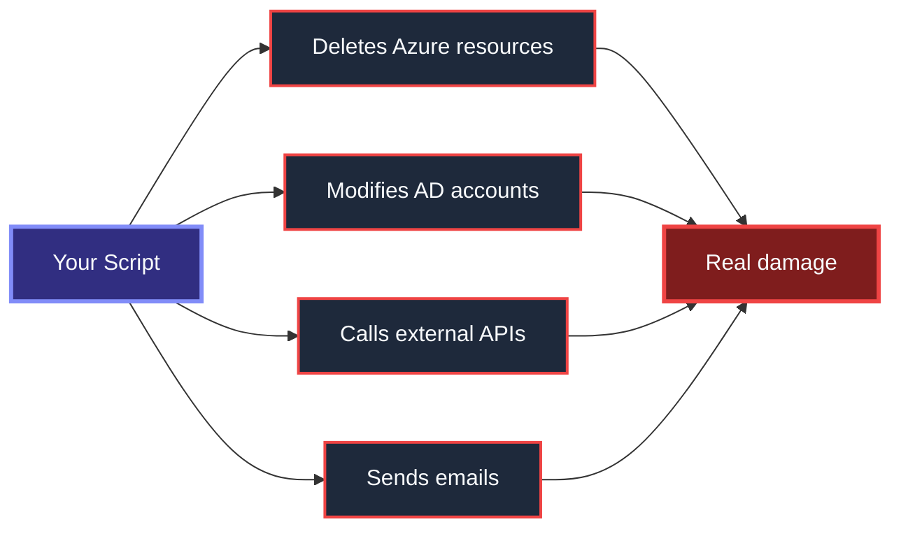
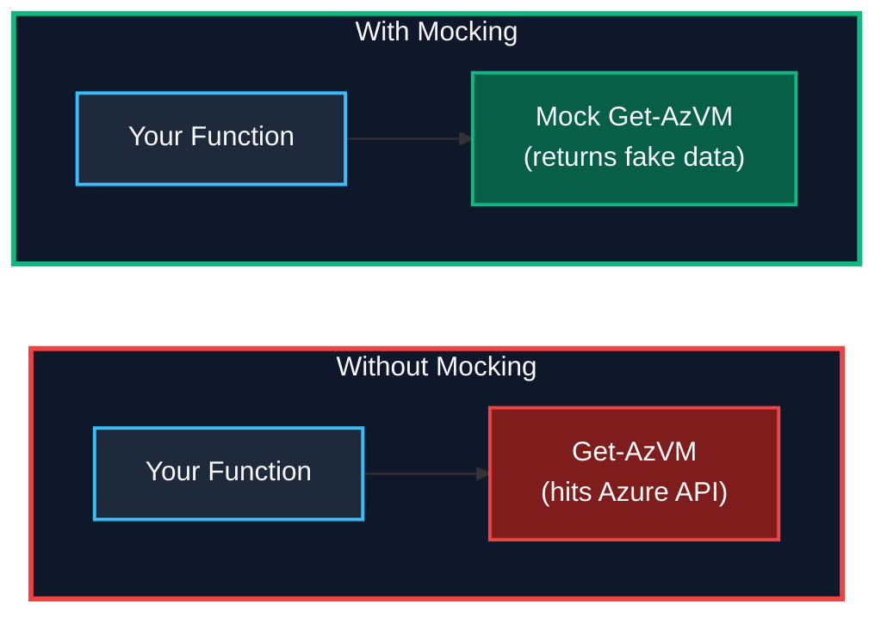
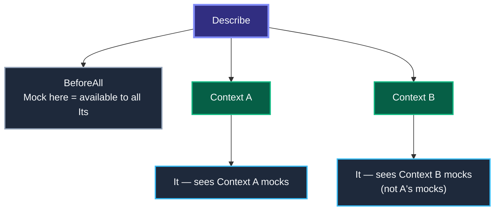
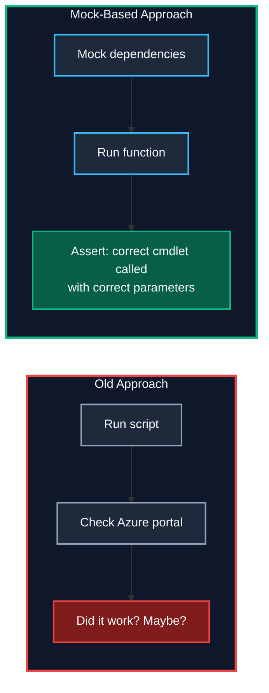

# Mocking & Test Isolation

> **Agenda:** 13:00–13:30 · 30-minute session · Day 1

---

## The Problem — Why You Can't Just Run the Code
Infrastructure scripts interact with **real systems**. Running them in a test means:



**You need a way to test logic without triggering side effects.** That's mocking.
---

## What Is Mocking?
Mocking replaces a real command with a **fake implementation** during a test. The fake returns controlled data so you can test your logic — not the dependency.



> *In Pester, Mocks, Stubs, and Fakes are all created with `Mock`. The difference is whether you also call `Should -Invoke`. See: [Martin Fowler — Mocks Aren't Stubs](https://martinfowler.com/articles/mocksArentStubs.html)*
---

## Pester Mocking — The Two Commands
| Command | Purpose |
|---|---|
| `Mock` | Replace a command with a fake |
| `Should -Invoke` | Verify the mock was called (or not) |

### Basic Pattern (AAA)

```powershell
Describe 'Remove-OldBackups' {
    BeforeAll {
        . $PSScriptRoot/../src/Remove-OldBackups.ps1
    }

    It 'Deletes files older than 30 days' {
        # ARRANGE — replace the dangerous command with a no-op
        Mock Remove-Item {}

        # ACT — run the function (it calls Remove-Item internally)
        Remove-OldBackups -Days 30

        # ASSERT — verify the mock was called exactly once
        Should -Invoke Remove-Item -Times 1 -Exactly
    }
}
```

**Nothing was deleted.** The mock intercepted `Remove-Item` and did nothing. But you proved your function *called* it.
---

## Real-World Enterprise Examples
### Mocking Azure Cmdlets

```powershell
Describe 'Get-VMStatus' {
    BeforeAll {
        . $PSScriptRoot/../src/Get-VMStatus.ps1
    }

    Context 'When VM is running' {
        It 'Returns Running status' {
            Mock Get-AzVM { return @{ PowerState = 'VM running' } }

            $result = Get-VMStatus -VMName 'prod-web-01'
            $result | Should -Be 'Running'
            Should -Invoke Get-AzVM -Times 1
        }
    }

    Context 'When VM does not exist' {
        It 'Returns $null' {
            Mock Get-AzVM { return $null }
            Get-VMStatus -VMName 'ghost-vm' | Should -BeNullOrEmpty
        }
    }
}
```

### Mocking REST API Calls

```powershell
Describe 'Get-WeatherAlert' {
    It 'Parses API response correctly' {
        Mock Invoke-RestMethod {
            return @{ alerts = @(@{ severity = 'High' }) }
        }

        $result = Get-WeatherAlert -City 'Ludwigshafen'
        $result.severity | Should -Be 'High'
        Should -Invoke Invoke-RestMethod -Times 1
    }
}
```
---

## Mock Scoping — Where Mocks Live
Mocks are scoped to the block where they are defined. This is a **Pester 5 change** from v4.



```powershell
Describe 'Scoping demo' {
    BeforeAll {
        Mock Get-Date { return '2025-01-01' }   # Available everywhere in this Describe
    }

    Context 'Scenario A' {
        BeforeEach {
            Mock Get-Service { return @{ Status = 'Running' } }
        }
        It 'Sees both mocks' {
            Get-Date     | Should -Be '2025-01-01'
            (Get-Service).Status | Should -Be 'Running'
        }
    }

    Context 'Scenario B' {
        It 'Sees only BeforeAll mock' {
            Get-Date | Should -Be '2025-01-01'
            # Get-Service is NOT mocked here
        }
    }
}
```
---

## ParameterFilter — Conditional Mocks
Return different results based on input:

```powershell
Mock Get-AzVM {
    return @{ Name = 'prod-web'; Status = 'Running' }
} -ParameterFilter { $Name -eq 'prod-web' }

Mock Get-AzVM {
    return @{ Name = 'dev-test'; Status = 'Stopped' }
} -ParameterFilter { $Name -eq 'dev-test' }
```
---

## Verifiable Mocks — Prove It Was Called

```powershell
It 'Sends a notification after cleanup' {
    Mock Send-MailMessage {} -Verifiable
    Mock Remove-Item {}

    Invoke-Cleanup

    Should -InvokeVerifiable   # Fails if Send-MailMessage was never called
}
```
---

## Test Isolation with TestDrive:
Pester provides a **temporary folder** that is auto-cleaned after each Describe:

```powershell
Describe 'Export-Report' {
    It 'Creates a CSV file' {
        Export-Report -Path "TestDrive:\report.csv"

        "TestDrive:\report.csv" | Should -Exist
        Get-Content "TestDrive:\report.csv" | Should -Not -BeNullOrEmpty
    }
}
# TestDrive:\ is automatically cleaned up — no leftover files
```
---

## Testing Behavior, Not Side Effects



| Question | Test This | Not This |
|---|---|---|
| "Does it call `Remove-Item`?" | `Should -Invoke Remove-Item` | Check if file was deleted |
| "Does it handle errors?" | `Mock` throws, assert function catches | Cause a real failure |
| "Does it use the right parameters?" | `ParameterFilter` on the mock | Inspect Azure portal |
| "Does it skip when condition is false?" | `Should -Invoke -Times 0` | Manually verify nothing happened |
---

## When NOT to Mock
**Mock at the boundary** — where your code meets something you don't control.

| Don't Mock | Instead |
|---|---|
| Pure functions (no side effects) | Call them directly — they're already safe |
| PowerShell operators (`if`, `-eq`) | Test the logic directly |
| Your own helper functions | Test them in their own test file |
| Everything | Only external dependencies |

> **Rule of thumb:** If the command doesn't leave your process (no network, no disk, no email), don't mock it.
---

## Key Takeaways
1. **Never call real infrastructure in a unit test** — mock Azure, AD, APIs, file system.
2. **`Mock` replaces, `Should -Invoke` verifies** — the two commands that make it work.
3. **Test behavior, not outcomes** — assert the right cmdlet was called with the right parameters.
4. **Scope matters** — mocks in `BeforeAll` are wide, mocks in `It` are narrow.
5. **Use `-ParameterFilter`** for different return values per input.
6. **Use `TestDrive:\`** for file system isolation.
7. **Mock at the boundary** — don't over-mock your own logic.

### Further Reading

| Resource | Link |
|---|---|
| Pester Mocking Docs | [pester.dev/docs/usage/mocking](https://pester.dev/docs/usage/mocking) |
| Pester TestDrive | [pester.dev/docs/usage/testdrive](https://pester.dev/docs/usage/testdrive) |

---

> *Next → Hands-on Lab: Unit Testing & Mocking (13:30)*