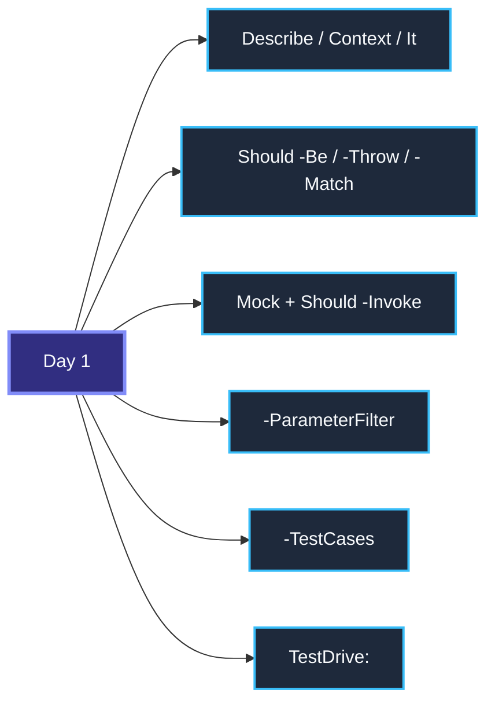
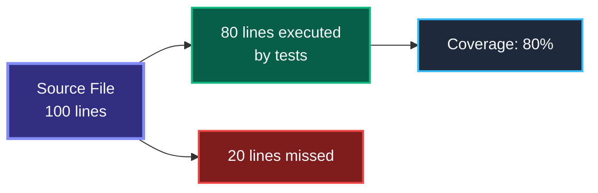
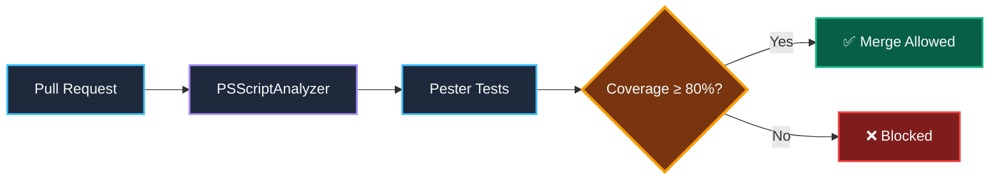
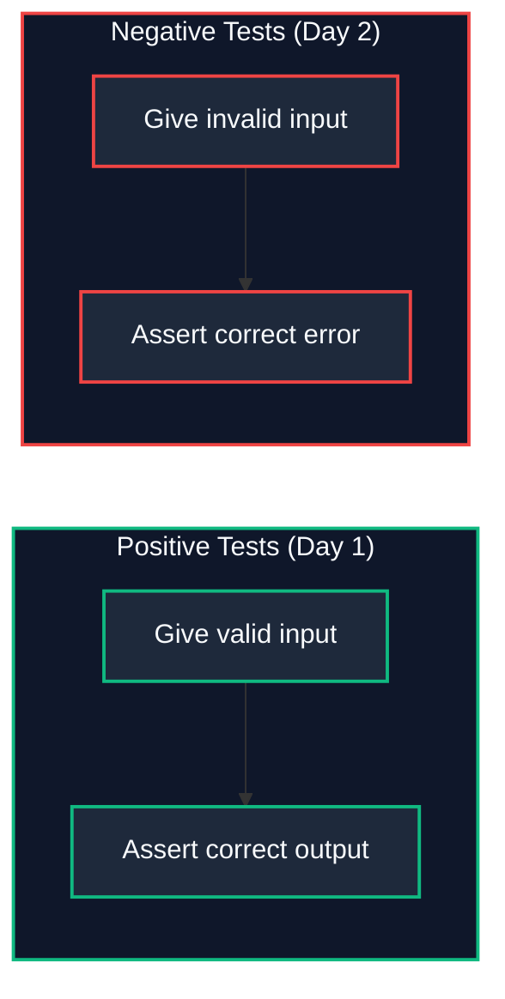
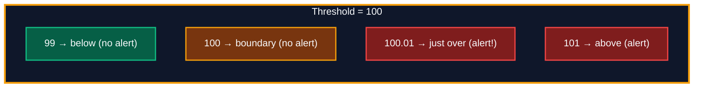
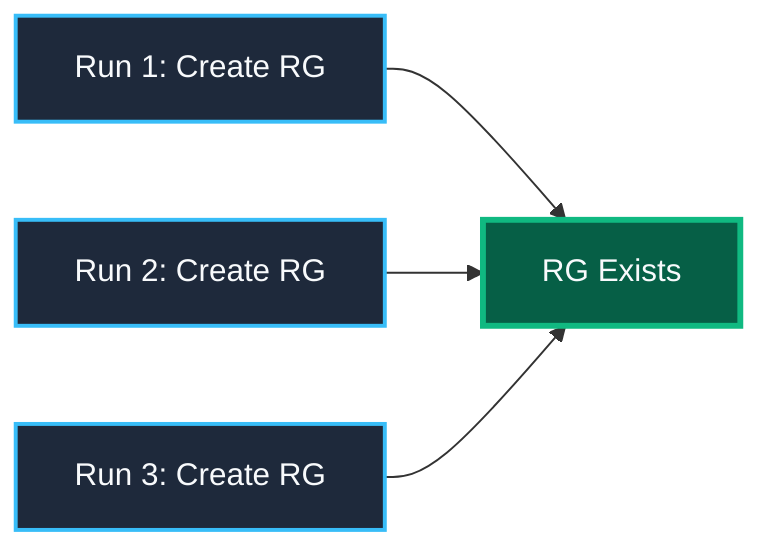

# Advanced Pester Patterns

> **Agenda:** Day 2 · 09:30–10:30 · 60-minute session

---

## Day 1 Recap — What You Already Know



**Today:** We go deeper — patterns that separate junior tests from enterprise-grade test suites.
---

## Code Coverage — Measuring What You Test

Code coverage answers: **"Which lines of my source code did the tests actually execute?"**



### Running Coverage in Pester

```powershell
$config = New-PesterConfiguration
$config.Run.Path = './tests'
$config.CodeCoverage.Enabled = $true
$config.CodeCoverage.Path = './PSCode'              # What to measure
$config.CodeCoverage.CoveragePercentTarget = 80     # Fail if below 80%
$config.CodeCoverage.OutputFormat = 'JaCoCo'        # CI-compatible format
$config.CodeCoverage.OutputPath = './coverage.xml'

Invoke-Pester -Configuration $config
```

### What Coverage Tells You (and Doesn't)

| Coverage Tells You | Coverage Does NOT Tell You |
|---|---|
| Which lines were executed | Whether assertions are meaningful |
| Which branches were taken | Whether edge cases are covered |
| Which functions were never called | Whether the tests are correct |
| Where to focus next | Whether the code is well-designed |

> **Rule:** 80% is a good enterprise target. 100% is usually wasteful — it forces you to test trivial code (getters, constructors) that adds test maintenance with no value.
---

## Quality Gates — CI That Blocks Bad Code

A quality gate is a CI check that **prevents deployment** when tests fail or coverage drops.



### Pester's Built-in Exit Code

```powershell
$config.Run.Exit = $true   # Exit code ≠ 0 when tests fail → CI marks build as failed
```
---

## Negative Testing — Proving Errors Are Handled

Negative tests verify your code **fails correctly** — the right exception, the right message, the right recovery.



### Patterns for Negative Tests

```powershell
# Pattern 1: Assert the error message
It 'Rejects empty name' {
    { Deploy-Resource -Name '' } | Should -Throw '*cannot be empty*'
}

# Pattern 2: Assert the exception type
It 'Throws ArgumentException for null' {
    { Deploy-Resource -Name $null } | Should -Throw -ExceptionType ([System.ArgumentException])
}

# Pattern 3: Assert a mock was NOT called (nothing happened)
It 'Does not deploy when validation fails' {
    Mock New-AzResource {}
    { Deploy-Resource -Name 'x' } | Should -Throw
    Should -Invoke New-AzResource -Times 0   # Proves it stopped before Azure call
}
```
---

## Boundary Testing — Testing the Edges

Boundary tests check values **at, just below, and just above** a threshold. They catch off-by-one bugs.



### Implementation with -TestCases

```powershell
It 'Cost <Cost> vs Threshold <Threshold> → AlertSent=<Expected>' -TestCases @(
    @{ Cost = 99;     Threshold = 100; Expected = $false }   # below
    @{ Cost = 100;    Threshold = 100; Expected = $false }   # boundary: equal = no
    @{ Cost = 100.01; Threshold = 100; Expected = $true }    # just over
    @{ Cost = 101;    Threshold = 100; Expected = $true }    # above
) {
    param($Cost, $Threshold, $Expected)
    $r = Send-CostAlert -CurrentCost $Cost -Threshold $Threshold
    $r.AlertSent | Should -Be $Expected
}
```
---

## Idempotency Testing — Run It Twice, Same Result

An idempotent operation produces the **same result** whether you run it once or ten times. Critical for infrastructure scripts.



### Testing Idempotency

```powershell
Describe 'Deploy-ResourceGroup — Idempotency' {
    It 'Creates RG on first call' {
        Mock Get-AzResourceGroup { $null }         # RG doesn't exist
        Mock New-AzResourceGroup { @{ Status = 'Created' } }

        Deploy-ResourceGroup -Name 'rg-test'
        Should -Invoke New-AzResourceGroup -Times 1
    }

    It 'Skips creation on second call (RG already exists)' {
        Mock Get-AzResourceGroup { @{ Name = 'rg-test' } }  # RG exists
        Mock New-AzResourceGroup {}

        Deploy-ResourceGroup -Name 'rg-test'
        Should -Invoke New-AzResourceGroup -Times 0   # Not called!
    }
}
```
---

## Tag-Based Test Execution — Run What You Need

Tags let you categorize tests and run subsets:

```powershell
Describe 'Cost Alerts' -Tag 'Unit', 'CostMonitor' {
    It 'Sends alert over threshold' -Tag 'Critical' { ... }
    It 'Skips when under budget' { ... }
}
```

```powershell
# Run only Critical tests
Invoke-Pester -Tag 'Critical'

# Run everything EXCEPT slow integration tests
Invoke-Pester -ExcludeTag 'Integration', 'Slow'

# Via configuration
$config = New-PesterConfiguration
$config.Filter.Tag = @('Unit')
$config.Filter.ExcludeTag = @('Integration')
```

| Use Case | Tag Strategy |
|---|---|
| Fast local dev | `-Tag 'Unit'` |
| CI full suite | No filter (run all) |
| Pre-commit hook | `-Tag 'Critical'` |
| Nightly build | `-Tag 'Integration'` |
---

## BeforeDiscovery — Data-Driven Test Generation

`BeforeDiscovery` runs during Pester's **Discovery phase** — before any tests execute. Use it to generate test cases dynamically.

```powershell
BeforeDiscovery {
    # This runs FIRST — Pester reads it to discover how many tests to create
    $testModules = Get-ChildItem './PSCode' -Directory | ForEach-Object {
        @{ Name = $_.Name; Path = $_.FullName }
    }
}

Describe 'Module <Name> has a test file' -ForEach $testModules {
    It 'Test file exists' {
        "$PSScriptRoot/../tests/PSCode-$($_.Name).Tests.ps1" | Should -Exist
    }
}
```

> **Discovery vs Run:** Code outside `BeforeAll`/`It` runs during Discovery. `BeforeDiscovery` makes this explicit and intentional. See [pester.dev — Discovery and Run](https://pester.dev/docs/usage/discovery-and-run).
---

## Custom Should Operators — Extend Pester

You can register custom assertions with `Add-ShouldOperator`:

```powershell
function BeValidJson {
    param($ActualValue, [switch]$Negate)
    $valid = try { $ActualValue | ConvertFrom-Json; $true } catch { $false }
    if ($Negate) { $valid = -not $valid }
    return [PSCustomObject]@{
        Succeeded = $valid
        FailureMessage = "Expected $(if($Negate){'invalid'}else{'valid'}) JSON but got: $ActualValue"
    }
}
Add-ShouldOperator -Name 'BeValidJson' -Test ${function:BeValidJson}

# Usage:
'{"name":"test"}' | Should -BeValidJson
'not json' | Should -Not -BeValidJson
```

> *Source: [pester.dev — Add-ShouldOperator](https://pester.dev/docs/commands/Add-ShouldOperator)*
---

## CI/CD Integration — GitHub Actions

```yaml
name: Pester Tests
on: [push, pull_request]
jobs:
  test:
    runs-on: windows-latest
    steps:
    - uses: actions/checkout@v4
    - name: Install Pester
      shell: pwsh
      run: Install-Module Pester -Force -Scope CurrentUser

    - name: Run Tests
      shell: pwsh
      run: |
        $config = New-PesterConfiguration
        $config.Run.Path = './tests'
        $config.Run.Exit = $true
        $config.CodeCoverage.Enabled = $true
        $config.CodeCoverage.Path = './PSCode'
        $config.CodeCoverage.CoveragePercentTarget = 80
        $config.TestResult.Enabled = $true
        $config.TestResult.OutputFormat = 'NUnitXml'
        $config.Output.CIFormat = 'GithubActions'
        Invoke-Pester -Configuration $config
```
---

## GitHub Copilot for Test Generation

Copilot can scaffold Pester tests from function signatures. Tips:

| Technique | Prompt |
|---|---|
| Generate from function | *"Write Pester 5 tests for this function"* |
| Add edge cases | *"Add negative tests and boundary tests"* |
| Mock strategy | *"Mock all Azure cmdlets, test the logic only"* |
| Coverage gaps | *"What lines are not covered? Add tests for them"* |

> **Important:** Always review generated tests. Copilot may use Pester v4 syntax (`Assert-MockCalled` instead of `Should -Invoke`). Correct before committing.
---

## Key Takeaways
1. **Code coverage** measures execution, not correctness — 80% is a good target.
2. **Quality gates** block bad code at the PR level — `$config.Run.Exit = $true`.
3. **Negative tests** prove errors are handled — `Should -Throw '*pattern*'`.
4. **Boundary tests** catch off-by-one bugs — test at, below, and above thresholds.
5. **Idempotency tests** ensure scripts are safe to re-run.
6. **Tags** let you run test subsets — `Unit` for dev, all for CI.
7. **BeforeDiscovery** generates tests dynamically from data.
8. **CI/CD** runs Pester with `NUnitXml` output and GitHub Actions annotations.

### Further Reading

| Resource | Link |
|---|---|
| Pester Code Coverage | [pester.dev/docs/usage/code-coverage](https://pester.dev/docs/usage/code-coverage) |
| Pester Discovery & Run | [pester.dev/docs/usage/discovery-and-run](https://pester.dev/docs/usage/discovery-and-run) |
| Pester CI Integration | [pester.dev/docs/usage/test-results](https://pester.dev/docs/usage/test-results) |
| Add-ShouldOperator | [pester.dev/docs/commands/Add-ShouldOperator](https://pester.dev/docs/commands/Add-ShouldOperator) |

---

> *Next → Hands-on Lab: Advanced Patterns & Exercises (10:30)*
