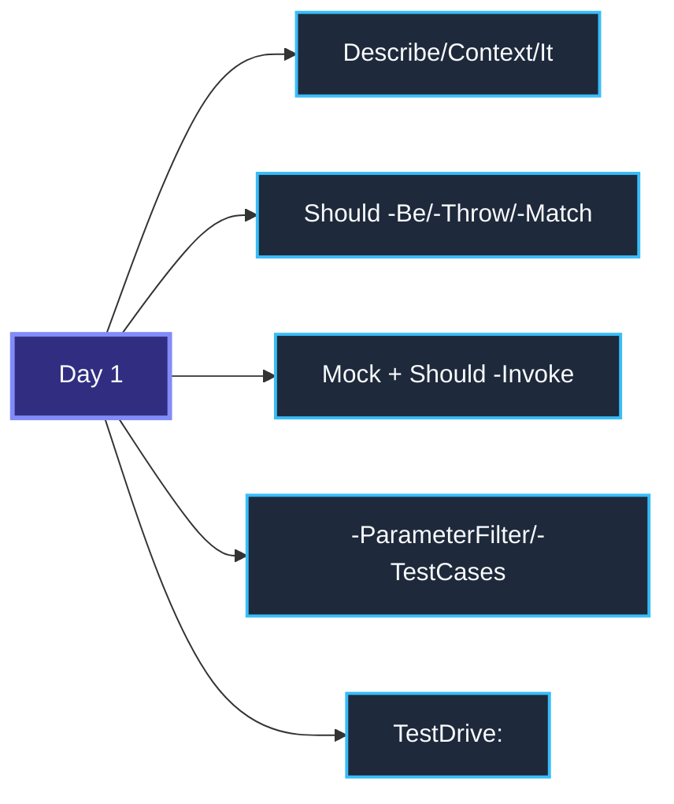
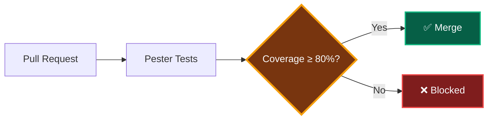

# Advanced Pester Patterns

> **Agenda:** Day 2 · 09:30–10:30 · 60-minute session

---

## Day 1 Recap



**Today:** Patterns that make tests enterprise-grade.
---

## 1. Code Coverage

> **What:** Measures which source lines your tests executed.
> **Why:** Find untested code before it breaks in production.
> **Use case:** PR gate — block merge if coverage drops below 80%.

```powershell
$config = New-PesterConfiguration                      # Create a fresh Pester 5 config object
$config.CodeCoverage.Enabled = $true                    # Turn on coverage analysis
$config.CodeCoverage.Path = './PSCode-Source'            # Which source files to measure
$config.CodeCoverage.CoveragePercentTarget = 80          # Fail if below 80% — enterprise threshold
Invoke-Pester -Configuration $config                    # Run tests + generate coverage report
```

| Coverage tells you | Coverage does NOT tell you |
|---|---|
| Which lines ran | Whether assertions are meaningful |
| Which branches were taken | Whether edge cases are covered |
| Where to focus next | Whether tests are correct |

> **Target 80%.** 100% is wasteful — tests for trivial getters add maintenance, not value.
---

## 2. Quality Gates

> **What:** CI check that blocks deployment on test failure.
> **Why:** Bad code never reaches production.
> **Use case:** Azure DevOps pipeline rejects PR when tests fail.



The key setting:
```powershell
$config.Run.Exit = $true   # Non-zero exit code on failure → CI fails the build
```
---

## 3. Negative Testing

> **What:** Testing that your function shows the right error when someone gives it wrong input.
> **Why:** Users will always make mistakes. Your function should say "hey, that's wrong" clearly — not crash with a 500-line Azure stack trace.
> **Use case:** Someone types `bad@name!` as a resource name → your function says "invalid characters" instead of calling Azure and failing there.

```powershell
# From Day 1 Module 05 — Deploy-AzureResourceWithValidation
It 'Rejects names with special characters' {
    # We wrap the function call in { } so Pester can catch the error
    # '*invalid characters*' means: the error message must contain these words
    { Deploy-AzureResourceWithValidation -Name 'bad@name!' } |
        Should -Throw '*invalid characters*'
}

It 'Does NOT call Azure when the name is invalid' {
    # We create a fake for New-AzResource (the Azure call)
    Mock New-AzResource {}
    # We call the function with a bad name — it will throw, but we catch it
    try { Deploy-AzureResourceWithValidation -Name 'x' } catch {}
    # Now we check: was New-AzResource called? It should NOT have been.
    # -Times 0 means "zero calls" = the function stopped before reaching Azure
    Should -Invoke New-AzResource -Times 0
}
```

**Two things to always check:** (1) Is the error message helpful? (2) Did the function stop before doing anything dangerous?
---

## 4. Boundary Testing

> **What:** Testing what happens at the exact edge of a rule — not just clearly above or below.
> **Why:** Most bugs hide at the boundary. If your rule is "alert when cost > 100", you need to know: does exactly $100 trigger it or not?
> **Use case:** Your cost alert should fire at $100.01 but NOT at $100.00 — a one-cent difference that could mean thousands of false alerts.

```powershell
# From Day 1 Module 09 — Send-CostAlert
# -TestCases runs this test 3 times, once for each row
It 'Cost <Cost> vs Threshold <Threshold>' -TestCases @(
    @{ Cost = 99;     Threshold = 100; Expected = $false }   # clearly below → no alert
    @{ Cost = 100;    Threshold = 100; Expected = $false }   # exactly at the line → no alert
    @{ Cost = 100.01; Threshold = 100; Expected = $true }    # one cent over → alert!
) {
    # param() receives the values from each test case row above
    param($Cost, $Threshold, $Expected)
    # Call the function and check if AlertSent matches what we expect
    (Send-CostAlert -CurrentCost $Cost -Threshold $Threshold).AlertSent |
        Should -Be $Expected
}
```

**Always test three values:** below, exactly at, and just above the threshold.
---

## 5. Idempotency Testing

> **What:** Making sure a script does the same thing whether you run it once or ten times.
> **Why:** In infrastructure, running a script twice should NOT create two resource groups. It should see the first one exists and skip.
> **Use case:** Your `Deploy-ResourceGroup` runs in a pipeline every night. Monday it creates the RG. Tuesday it should say "already exists" and do nothing.

```powershell
# From Day 1 Module 07 — Deploy-ResourceGroup
Context 'When the Resource Group already exists' {
    BeforeAll {
        # This mock says: "yes, the RG already exists"
        Mock Get-AzResourceGroup { @{ Name = 'rg-test' } }
        # This mock is the creation command — it should never run
        Mock New-AzResourceGroup {}
    }
    It 'Does not create it again' {
        Deploy-ResourceGroup -Name 'rg-test'
        # -Times 0 proves New-AzResourceGroup was never called
        # The function saw the RG exists and skipped creation
        Should -Invoke New-AzResourceGroup -Times 0
    }
}
```

**The test proves:** "If it already exists, don't create it again."
---

## 6. Tag-Based Execution

> **What:** Labels on your tests so you can run just a part of them.
> **Why:** You have 500 tests. Before a quick commit, you want to run only the 10 most important ones (2 seconds). In CI, you run all 500.
> **Use case:** Tag critical tests as `'Critical'`, slow Azure tests as `'Integration'`. Run `-Tag 'Critical'` locally, full suite in the pipeline.

```powershell
# You add -Tag to Describe or It — it's just a label
Describe 'Cost Alerts' -Tag 'Unit', 'Critical' {
    # Every test inside inherits the Describe tags
    # This test has 3 tags: Unit + Critical (from Describe) + Smoke (its own)
    It 'Sends alert over threshold' -Tag 'Smoke' { ... }
}
```

```powershell
# Run only the tests you need right now
Invoke-Pester -Tag 'Critical'              # Just critical tests (fast)
Invoke-Pester -ExcludeTag 'Integration'    # Skip slow tests that need Azure
```

| When | What to run |
|---|---|
| Quick local check | `-Tag 'Critical'` (seconds) |
| Before commit | `-Tag 'Unit'` (fast) |
| CI pipeline | Everything (no filter) |
| Nightly build | `-Tag 'Integration'` (slow) |
---

## 7. BeforeDiscovery

> **What:** Tells Pester to look at your folders/files FIRST, then create tests based on what it finds.
> **Why:** When someone adds a new PSCode module tomorrow, a test for it appears automatically — nobody has to write anything.
> **Use case:** You have 9 PSCode modules. Instead of writing 9 hardcoded Describe blocks, you write 1 template and Pester creates 9 tests from the folder list.

```powershell
# BeforeDiscovery runs BEFORE any tests — Pester reads this first
BeforeDiscovery {
    # Look at all folders inside PSCode-Source
    $modules = Get-ChildItem './PSCode-Source' -Directory |
        ForEach-Object { @{ Name = $_.Name } }
    # Now $modules = @( @{Name='01_knowledge_refresh'}, @{Name='02_advanced_functions'}, ... )
}

# -ForEach creates one Describe PER module automatically
# <Name> in the title gets replaced with the actual folder name
Describe 'Module <Name>' -ForEach $modules {
    It 'Has a test file' {
        # Check that a matching test file exists for this module
        Get-ChildItem '../tests' -Filter "*$($_.Name)*" |
            Should -Not -BeNullOrEmpty
    }
}
# Add a 10th module folder tomorrow → 10th test appears automatically
```

**The magic:** You never update this test file. New modules get tested just by existing.
---

## 8. CI/CD with GitHub Actions

> **What:** Run Pester automatically on every push/PR.
> **Why:** No human forgets to run tests.
> **Use case:** Pester runs on PR, blocks merge if any test fails.

```yaml
- name: Run Pester
  shell: pwsh                                    # Use PowerShell (not bash)
  run: |
    Install-Module Pester -Force -Scope CurrentUser  # Install Pester 5 on the CI runner
    $config = New-PesterConfiguration                # Create config object
    $config.Run.Path = './tests'                     # Where to find test files
    $config.Run.Exit = $true                         # Exit code ≠ 0 on failure → build fails
    $config.CodeCoverage.Enabled = $true             # Measure coverage in CI
    $config.Output.CIFormat = 'GithubActions'        # Native GitHub annotations on failures
    Invoke-Pester -Configuration $config             # Run everything
```
---

## Exercises Preview

The Day 2 lab has **6 fill-in-the-blank exercises** — you replace `___BLANK___` with real Pester code.

| # | Exercise | Pattern | From Day 1? |
|---|---|---|---|
| 01 | Mock Basics | Mock + Should -Invoke | Review |
| 02 | Should Assertions | -Be, -Throw, -BeOfType | Review |
| 03 | Data-Driven Tests | -ParameterFilter, -TestCases | Review |
| 04 | Negative Testing | Should -Throw, -Times 0 | **New** |
| 05 | Boundary Testing | -TestCases at threshold | **New** |
| 06 | Idempotency | Mock exists → skip create | **New** |

Run: `cd Pester-Delivery/Day-2/Pester-Lab-Day2 && .\Start-Lab-Day2.ps1`

---

## Key Takeaways
1. **Coverage** — measure it, gate on it (80%), don't chase 100%.
2. **Quality gates** — `$config.Run.Exit = $true` blocks bad builds.
3. **Negative tests** — prove errors are handled, not just happy paths.
4. **Boundary tests** — test at, below, and above the threshold.
5. **Idempotency** — mock "exists" → verify "create" was not called.
6. **Tags** — `-Tag 'Unit'` for speed, no filter for CI.
7. **BeforeDiscovery** — auto-generate tests from data.
8. **CI/CD** — Pester + GitHub Actions/Azure DevOps = automated quality.

> *Next → Hands-on Lab: Exercises (10:30)*