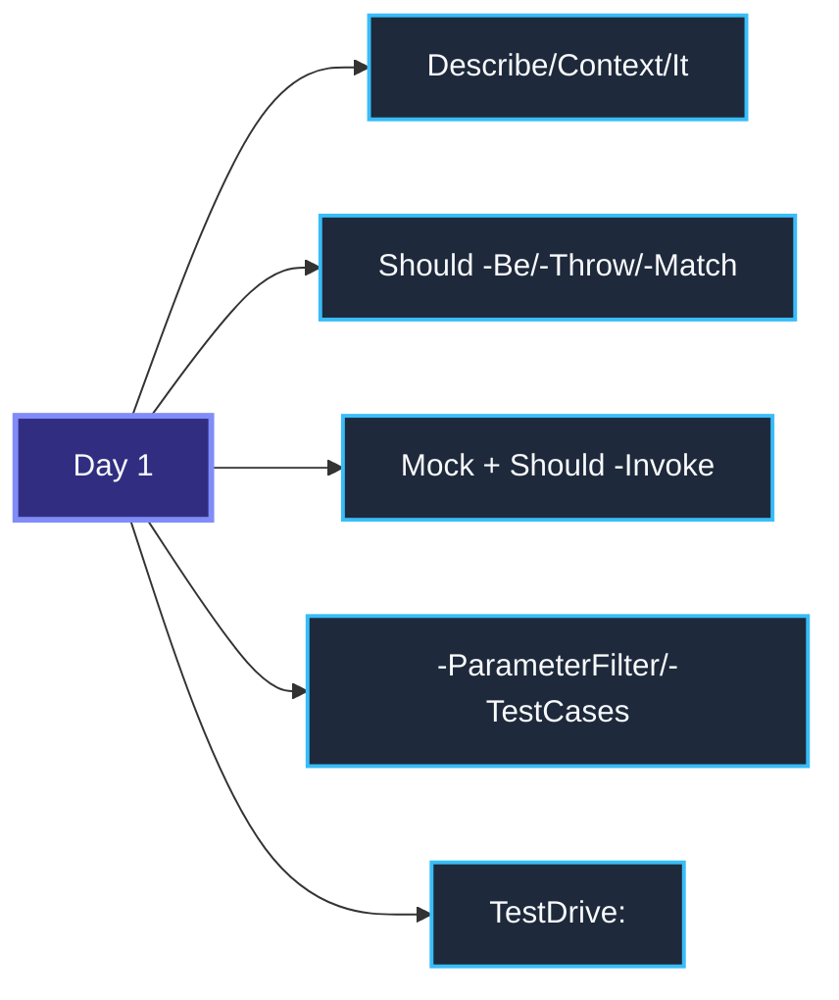
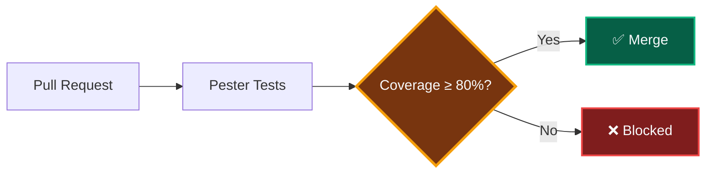

# Advanced Pester Patterns

> **Agenda:** Day 2 · 09:30–10:30 · 60-minute session

---

## Day 1 Recap



**Today:** Patterns that make tests enterprise-grade.
---

## 1. Code Coverage

> **What:** Measures which source lines your tests executed.
> **Why:** Find untested code before it breaks in production.
> **Use case:** PR gate — block merge if coverage drops below 80%.

```powershell
$config = New-PesterConfiguration
$config.CodeCoverage.Enabled = $true
$config.CodeCoverage.Path = './PSCode-Source'
$config.CodeCoverage.CoveragePercentTarget = 80
Invoke-Pester -Configuration $config
```

| Coverage tells you | Coverage does NOT tell you |
|---|---|
| Which lines ran | Whether assertions are meaningful |
| Which branches were taken | Whether edge cases are covered |
| Where to focus next | Whether tests are correct |

> **Target 80%.** 100% is wasteful — tests for trivial getters add maintenance, not value.
---

## 2. Quality Gates

> **What:** CI check that blocks deployment on test failure.
> **Why:** Bad code never reaches production.
> **Use case:** Azure DevOps pipeline rejects PR when tests fail.



The key setting:
```powershell
$config.Run.Exit = $true   # Non-zero exit code on failure → CI fails the build
```
---

## 3. Negative Testing

> **What:** Tests that verify errors are handled correctly.
> **Why:** Prove your code fails gracefully, not silently.
> **Use case:** User enters invalid VM name → function throws clear error, not a cryptic Azure exception.

```powershell
# From Day 1 Module 05 — Deploy-AzureResourceWithValidation
It 'Rejects names with special characters' {
    { Deploy-AzureResourceWithValidation -Name 'bad@name!' } |
        Should -Throw '*invalid characters*'
}

It 'Does NOT call Azure when validation fails' {
    Mock New-AzResource {}
    try { Deploy-AzureResourceWithValidation -Name 'x' } catch {}
    Should -Invoke New-AzResource -Times 0
}
```

**Pattern:** Test the error message AND that dangerous commands were never called.
---

## 4. Boundary Testing

> **What:** Tests values at, below, and above a threshold.
> **Why:** Catches off-by-one bugs — the #1 logic error.
> **Use case:** Cost alert triggers at $100 — does $100.00 exactly fire or not?

```powershell
# From Day 1 Module 09 — Send-CostAlert
It 'Cost <Cost> vs Threshold <Threshold>' -TestCases @(
    @{ Cost = 99;     Threshold = 100; Expected = $false }
    @{ Cost = 100;    Threshold = 100; Expected = $false }   # equal = no alert
    @{ Cost = 100.01; Threshold = 100; Expected = $true }    # just over!
) {
    param($Cost, $Threshold, $Expected)
    (Send-CostAlert -CurrentCost $Cost -Threshold $Threshold).AlertSent |
        Should -Be $Expected
}
```

**Pattern:** Always test the boundary value itself, not just "above" and "below".
---

## 5. Idempotency Testing

> **What:** Proves a function is safe to run multiple times.
> **Why:** Infrastructure scripts must not create duplicates.
> **Use case:** `Deploy-ResourceGroup` — run twice, only one RG exists.

```powershell
# From Day 1 Module 07 — Deploy-ResourceGroup
Context 'RG already exists' {
    BeforeAll {
        Mock Get-AzResourceGroup { @{ Name = 'rg-test' } }
        Mock New-AzResourceGroup {}
    }
    It 'Skips creation' {
        Deploy-ResourceGroup -Name 'rg-test'
        Should -Invoke New-AzResourceGroup -Times 0   # Not called!
    }
}
```

**Pattern:** Mock "exists" → verify "create" was NOT called.
---

## 6. Tag-Based Execution

> **What:** Categorize tests, run subsets.
> **Why:** Fast local dev, full suite in CI.
> **Use case:** Run only critical tests before commit (2 seconds), full suite in pipeline (2 minutes).

```powershell
Describe 'Cost Alerts' -Tag 'Unit', 'Critical' {
    It 'Sends alert over threshold' -Tag 'Smoke' { ... }
}
```

```powershell
Invoke-Pester -Tag 'Critical'              # Pre-commit: fast
Invoke-Pester -ExcludeTag 'Integration'    # CI: skip slow tests
```

| Scenario | Filter |
|---|---|
| Fast local dev | `-Tag 'Unit'` |
| Pre-commit hook | `-Tag 'Critical'` |
| CI full suite | No filter |
| Nightly | `-Tag 'Integration'` |
---

## 7. BeforeDiscovery

> **What:** Generates test cases dynamically during Pester's discovery phase.
> **Why:** New source files get tested automatically — no manual test updates.
> **Use case:** Auto-discover all PSCode modules and verify each has a test file.

```powershell
BeforeDiscovery {
    $modules = Get-ChildItem './PSCode-Source' -Directory |
        ForEach-Object { @{ Name = $_.Name } }
}

Describe 'Module <Name>' -ForEach $modules {
    It 'Has a test file' {
        Get-ChildItem '../tests' -Filter "*$($_.Name)*" |
            Should -Not -BeNullOrEmpty
    }
}
```

**Pattern:** Data drives test creation — add a module, a test appears automatically.
---

## 8. CI/CD with GitHub Actions

> **What:** Run Pester automatically on every push/PR.
> **Why:** No human forgets to run tests.
> **Use case:** Pester runs on PR, blocks merge if any test fails.

```yaml
- name: Run Pester
  shell: pwsh
  run: |
    Install-Module Pester -Force -Scope CurrentUser
    $config = New-PesterConfiguration
    $config.Run.Path = './tests'
    $config.Run.Exit = $true
    $config.CodeCoverage.Enabled = $true
    $config.Output.CIFormat = 'GithubActions'
    Invoke-Pester -Configuration $config
```
---

## Exercises Preview

The Day 2 lab has **6 fill-in-the-blank exercises** — you replace `___BLANK___` with real Pester code.

| # | Exercise | Pattern | From Day 1? |
|---|---|---|---|
| 01 | Mock Basics | Mock + Should -Invoke | Review |
| 02 | Should Assertions | -Be, -Throw, -BeOfType | Review |
| 03 | Data-Driven Tests | -ParameterFilter, -TestCases | Review |
| 04 | Negative Testing | Should -Throw, -Times 0 | **New** |
| 05 | Boundary Testing | -TestCases at threshold | **New** |
| 06 | Idempotency | Mock exists → skip create | **New** |

Run: `cd Pester-Delivery/Day-2/Pester-Lab-Day2 && .\Start-Lab-Day2.ps1`

---

## Key Takeaways
1. **Coverage** — measure it, gate on it (80%), don't chase 100%.
2. **Quality gates** — `$config.Run.Exit = $true` blocks bad builds.
3. **Negative tests** — prove errors are handled, not just happy paths.
4. **Boundary tests** — test at, below, and above the threshold.
5. **Idempotency** — mock "exists" → verify "create" was not called.
6. **Tags** — `-Tag 'Unit'` for speed, no filter for CI.
7. **BeforeDiscovery** — auto-generate tests from data.
8. **CI/CD** — Pester + GitHub Actions/Azure DevOps = automated quality.

> *Next → Hands-on Lab: Exercises (10:30)*