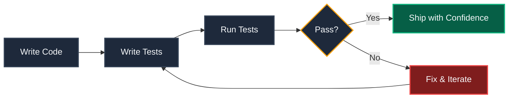
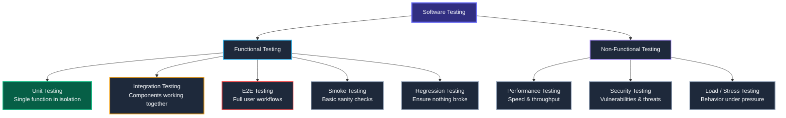
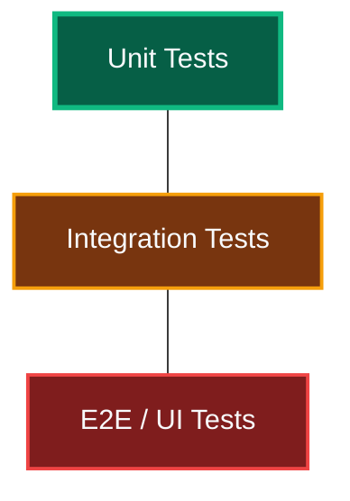
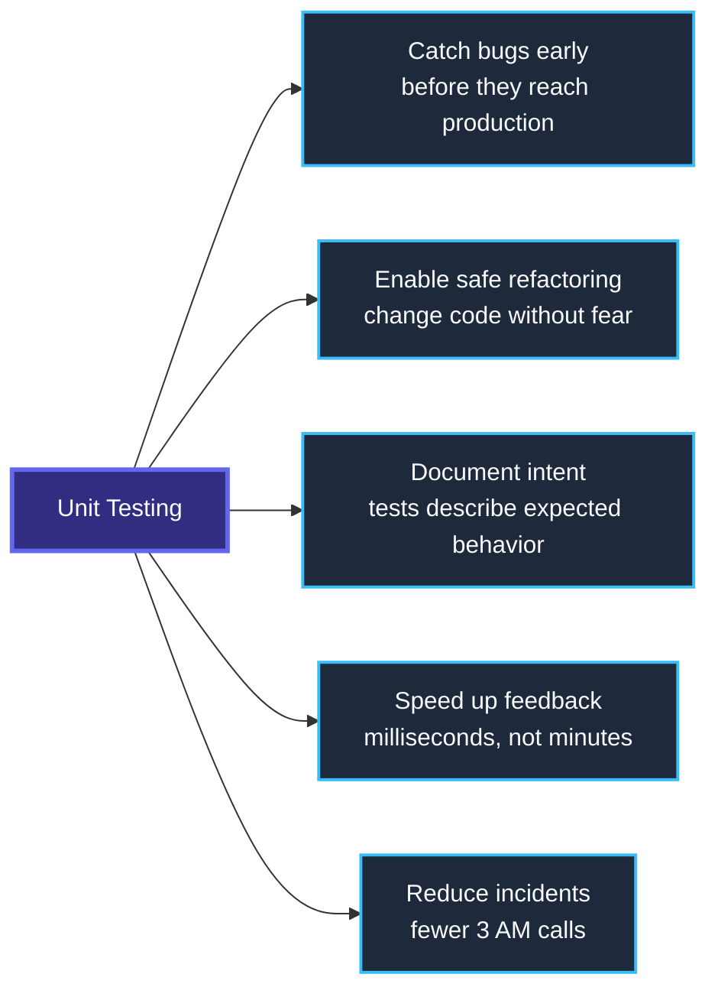
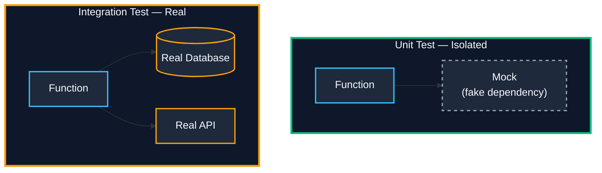
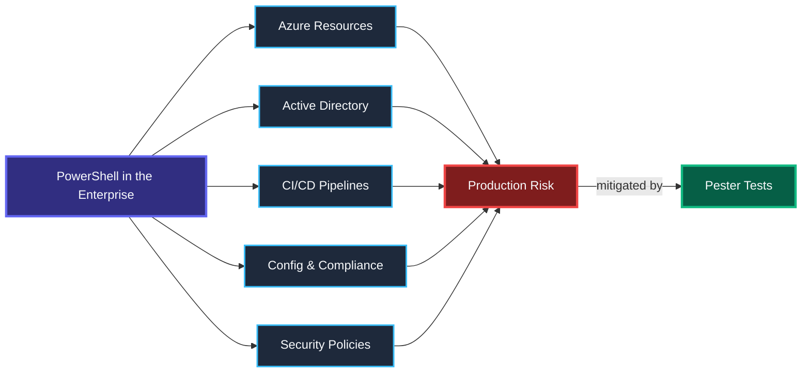
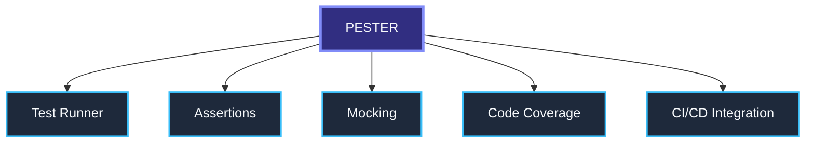
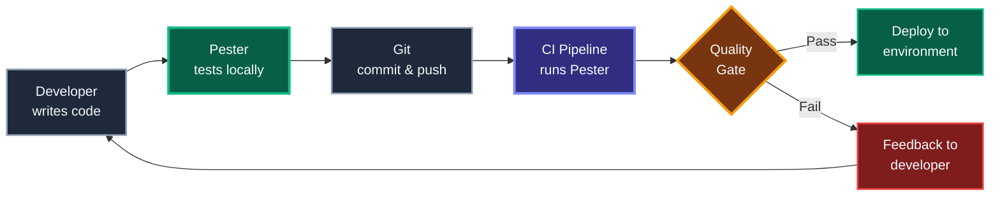
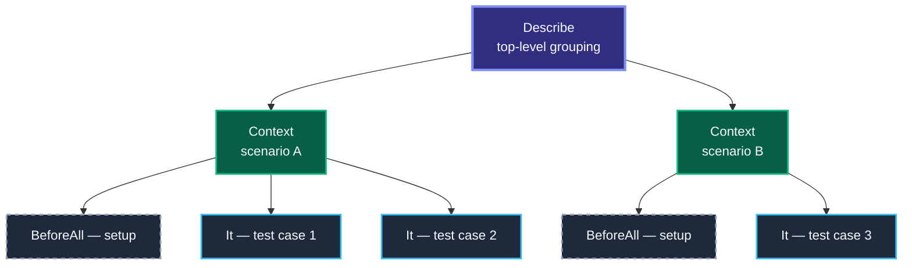
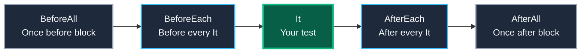

# Fundamentals of Unit Testing — Introduction & Context

---

<details open>
<summary><strong>What Is Software Testing?</strong></summary>


Software testing is the practice of **verifying that code behaves as expected** before it reaches production. It reduces risk, increases confidence, and creates a safety net for change.




</details>

---

<details>
<summary><strong>Types of Software Testing</strong></summary>


Before diving into unit tests, it helps to see the **full landscape** of testing approaches.



| Type | Purpose | Speed | Example |
|---|---|---|---|
| **Unit** | Test a single function in isolation | Milliseconds | Does `Get-UserAge` return correct value? |
| **Integration** | Test components working together | Seconds | Does the function connect to the DB correctly? |
| **E2E** | Test full user/system workflow | Minutes | Does the deployment pipeline complete? |
| **Smoke** | Quick sanity — does it even start? | Fast | Does the module import without errors? |
| **Regression** | Verify old bugs stay fixed | Varies | Re-run all tests after a code change |
| **Negative** | Verify correct behavior on bad input | Fast | Does it throw on `$null` input? |
| **Idempotency** | Same result on repeated execution | Medium | Running the script twice produces no side effects |


</details>

---

<details>
<summary><strong>Microsoft DevOps Test Taxonomy (L0–L4)</strong></summary>


Microsoft classifies tests into **levels** based on dependencies and execution time. This taxonomy is used across Azure DevOps, GitHub, and Microsoft engineering teams.

> *Source: [Microsoft — Shift left to make testing fast & reliable](https://learn.microsoft.com/en-us/devops/develop/shift-left-make-testing-fast-reliable)*

| Level | Type | Dependencies | Speed | When to Run |
|---|---|---|---|---|
| **L0** | Unit (in-memory) | Code only, no external deps | < 60ms each | Every build, every PR |
| **L1** | Unit (with stubs) | Code + mocked services | < 400ms each | Every build, every PR |
| **L2** | Functional | Assembly + SQL, file system | Seconds | PR validation, CI |
| **L3** | Functional (deployed) | Testable service deployment | Minutes | Post-deploy validation |
| **L4** | Integration (production) | Full product deployment | Minutes | Production canary |

**Key insight:** L0 and L1 (unit tests) should form **70%+** of your test portfolio. Pester excels here.


</details>

---

<details>
<summary><strong>The Testing Pyramid</strong></summary>


Not all tests are equal. The pyramid prioritizes **fast, cheap, isolated tests** at the base.



| Layer | % of Tests | Speed | Cost | Characteristics |
|---|---|---|---|---|
| **E2E / UI** | ~10% | Slow (minutes) | High | Fragile, tests full workflows |
| **Integration** | ~20% | Medium (seconds) | Medium | Uses real dependencies |
| **Unit** | ~70% | Fast (milliseconds) | Low | Isolated, mocked, most tests live here |

> *Origin: Mike Cohn's test pyramid, popularized by Martin Fowler. See [martinfowler.com/bliki/TestPyramid.html](https://martinfowler.com/bliki/TestPyramid.html)*


</details>

---

<details>
<summary><strong>Why Unit Testing Matters</strong></summary>




> A bug found in development costs **10x less** to fix than a bug found in production.

### The FIRST Principles of Good Unit Tests

Write tests that are:

| Principle | Meaning |
|---|---|
| **F**ast | Run in milliseconds, not seconds |
| **I**solated | No shared state, no dependency on other tests or order |
| **R**epeatable | Same result every time, on any machine |
| **S**elf-validating | Pass or fail — no manual inspection needed |
| **T**imely | Written close to when the code is written (ideally before) |


</details>

---

<details>
<summary><strong>Unit Testing vs Integration Testing</strong></summary>




| Aspect | Unit Test | Integration Test |
|---|---|---|
| **Dependencies** | Mocked / stubbed | Real services |
| **Speed** | Very fast | Slower |
| **Failure cause** | Clear & isolated | Ambiguous |
| **When to use** | Logic, branching, calculations | End-to-end flows, API contracts |


</details>

---

<details>
<summary><strong>The AAA Pattern — Arrange, Act, Assert</strong></summary>


Every well-structured test follows this three-step pattern:

```powershell
It 'Returns Running for a running VM' {
    # ARRANGE — set up preconditions and mocks
    Mock Get-AzVM { return @{ PowerState = 'VM running' } }

    # ACT — call the function under test
    $result = Get-VMStatus -VMName 'prod-web-01'

    # ASSERT — verify the outcome
    $result | Should -Be 'Running'
}
```

| Step | Purpose | Pester Equivalent |
|---|---|---|
| **Arrange** | Set up test data, mocks, prerequisites | `BeforeAll`, `BeforeEach`, `Mock` |
| **Act** | Execute the function/code under test | Call the function |
| **Assert** | Verify the result matches expectations | `Should -Be`, `Should -Throw`, etc. |


</details>

---

<details>
<summary><strong>Why Testing PowerShell in the Enterprise?</strong></summary>


PowerShell is no longer just a scripting language — in the enterprise it is **infrastructure as code**. Scripts manage Azure subscriptions, configure Active Directory, orchestrate CI/CD pipelines, and enforce compliance policies. A single untested script can cause outages, security gaps, or audit failures across environments.



### Enterprise Pain Points Without Tests

| Scenario | Without Tests | With Pester Tests |
|---|---|---|
| Deploy Azure resources | "I think the script works" | "I *know* it works — tests prove it" |
| Refactor a shared module | Fear of breaking things | Confidence from passing tests |
| New team member changes code | No safety net, silent failures | Tests catch regressions immediately |
| Audit / compliance review | No evidence of validation | Test reports as compliance artifacts |
| Production incident at 3 AM | Long debugging, unclear root cause | Tests pinpoint the broken logic |


</details>

---

<details>
<summary><strong>What Is Pester?</strong></summary>


> **Pester** is the ubiquitous **test and mock framework for PowerShell** — the standard tool for writing, running, and automating PowerShell tests.

*Source: [pester.dev](https://pester.dev/) — "Pester provides a framework for writing and running tests. It is most commonly used for writing unit and integration tests, but it is not limited to just that."*

### At a Glance

| Detail | Value |
|---|---|
| **Latest version** | 5.7+ (install latest with `Install-Module`) |
| **GitHub stars** | 3,300+ |
| **Contributors** | 147+ |
| **Platforms** | Windows, Linux, macOS |
| **PowerShell** | 5.1 and 7.2+ |
| **Install** | `Install-Module -Name Pester -Force` |
| **Run tests** | `Invoke-Pester ./tests` |
| **Docs** | [pester.dev](https://pester.dev/) |
| **Community** | [Discord #testing](https://discord.gg/powershell), [PowerShell.org](https://forums.powershell.org/c/pester/), [Stack Overflow](https://stackoverflow.com/questions/tagged/pester) |

### Five Core Capabilities



| Capability | What It Does |
|---|---|
| **Test Runner** | Discovers `*.Tests.ps1` files, executes tests, outputs NUnit/JUnit XML results |
| **Assertions** | `Should -Be`, `-BeExactly`, `-Exist`, `-Throw`, `-BeNullOrEmpty`, `-HaveCount` and more |
| **Mocking** | Replace any cmdlet with a fake using `Mock`, verify calls with `Should -Invoke` |
| **Code Coverage** | Measures tested vs untested lines — exports JaCoCo format via `New-PesterConfiguration` |
| **CI/CD Integration** | Native support for GitHub Actions, Azure DevOps, Jenkins, TeamCity, AppVeyor |

### Why Pester Over Other Approaches?

| Approach | Problem |
|---|---|
| Manual testing | Slow, error-prone, not repeatable, no audit trail |
| `Write-Host` debugging | No assertions, no automation, no CI integration |
| Custom test scripts | No standard structure, hard to maintain, no community |
| **Pester** | **Structured, automated, integrated, community-standard** |


</details>

---

<details>
<summary><strong>Where Pester Fits in DevOps</strong></summary>




> *Microsoft principle: "Shift left to test earlier — move quality upstream by performing testing tasks earlier in the pipeline."* ([source](https://learn.microsoft.com/en-us/devops/develop/shift-left-make-testing-fast-reliable))


</details>

---

<details>
<summary><strong>Pester Test Structure — At a Glance</strong></summary>


```powershell
Describe 'Component under test' {          # Group of related tests
    Context 'Given a specific scenario' {   # Sub-group / scenario
        BeforeAll { <# setup #> }           # Runs once before all tests in this block
        It 'Should do something expected' { # Single test case
            $result | Should -Be $expected  # Assertion
        }
    }
}
```



### Discovery vs Execution — Pester's Two Phases

Pester operates in **two distinct phases**. Understanding this avoids common pitfalls.

| Phase | What Happens | Do's | Don'ts |
|---|---|---|---|
| **Discovery** | Pester scans `*.Tests.ps1` files, parses `Describe`/`Context`/`It` blocks, builds a test catalog | Keep block names static | Don't put logic, variables, or function calls outside `BeforeAll`/`It` |
| **Execution** | Runs `BeforeAll` → `BeforeEach` → `It` → `AfterEach` → `AfterAll` in sequence | All test logic goes here | Don't assume discovery-phase code persists |

> **Common mistake:** Writing `$data = Get-Something` directly inside a `Describe` block. This runs during *Discovery*, not *Execution*. Move it into `BeforeAll`.


</details>

---

<details>
<summary><strong>Setup & Teardown — When Each Block Runs</strong></summary>




| Block | Runs | Use Case |
|---|---|---|
| `BeforeAll` | Once per Describe/Context | Import modules, dot-source functions |
| `BeforeEach` | Before every `It` | Set up mocks, reset state |
| `It` | The test itself | One assertion per test |
| `AfterEach` | After every `It` | Clean up per-test artifacts |
| `AfterAll` | Once per Describe/Context | Clean up shared resources |


</details>

---

<details>
<summary><strong>Common Assertion Operators</strong></summary>


| Operator | What It Checks | Example |
|---|---|---|
| `Should -Be` | Equality (case-insensitive) | `$x \| Should -Be 5` |
| `Should -BeExactly` | Equality (case-sensitive) | `$x \| Should -BeExactly 'Hello'` |
| `Should -BeNullOrEmpty` | Null or empty | `$x \| Should -BeNullOrEmpty` |
| `Should -Not -Be` | Inequality | `$x \| Should -Not -Be 0` |
| `Should -BeGreaterThan` | Greater than | `$x \| Should -BeGreaterThan 10` |
| `Should -BeLessOrEqual` | Less or equal | `$x \| Should -BeLessOrEqual 100` |
| `Should -Exist` | File/path exists | `'C:\log.txt' \| Should -Exist` |
| `Should -Throw` | Throws an exception | `{ Bad-Func } \| Should -Throw` |
| `Should -Throw '*pattern*'` | Exception message wildcard | `{ func } \| Should -Throw '*not found*'` |
| `Should -HaveCount` | Collection count | `$arr \| Should -HaveCount 3` |
| `Should -Match` | Regex match | `$x \| Should -Match '^\d{3}$'` |
| `Should -Invoke` | Mock was called | `Should -Invoke Get-AzVM -Times 1` |
| `Should -InvokeVerifiable` | All `-Verifiable` mocks called | `Should -InvokeVerifiable` |


</details>

---

<details>
<summary><strong>Pester 4 vs Pester 5 — What Changed?</strong></summary>


Windows ships Pester 3.x/4.x. This workshop uses **Pester 5**. Key differences:

| Feature | Pester 4 | Pester 5 |
|---|---|---|
| **Configuration** | Parameters on `Invoke-Pester` | `New-PesterConfiguration` object |
| **Verify mock calls** | `Assert-MockCalled` | `Should -Invoke` |
| **Mock scoping** | Entire Describe/Context | Block where defined only |
| **Discovery phase** | Not separated | Separate Discovery + Execution |
| **Code outside blocks** | Runs during test | Runs during Discovery (don't put logic here) |
| **`-TestCases` param filter** | Requires `param()` | No `param()` needed |
| **Code coverage config** | `-CodeCoverage` parameter | `$config.CodeCoverage.Enabled = $true` |
| **CI output** | `-OutputFile` / `-OutputFormat` | `$config.TestResult.OutputFormat` |
| **Install** | Ships with Windows | `Install-Module Pester -Force -SkipPublisherCheck` |

> **Upgrade tip:** If you have Pester 4 tests, most work in Pester 5 with one change: move code from Describe/Context bodies into `BeforeAll`.


</details>

---

<details>
<summary><strong>VS Code Integration</strong></summary>


Pester integrates with VS Code out of the box via the **PowerShell extension**:

| Feature | How to Use |
|---|---|
| **Test Explorer** | Open the Testing sidebar (flask icon) — discovers `*.Tests.ps1` files |
| **Run/Debug tests** | Click ▶ next to any `It` block, or right-click → Debug Test |
| **Inline results** | Green ✓ / red ✗ indicators appear next to each `It` |
| **Breakpoints in tests** | Set breakpoints inside `It` blocks and step through with F5 |
| **Integrated terminal** | Run `Invoke-Pester` directly in the VS Code terminal |
| **Code coverage** | Highlighted lines show which source code is covered |


</details>

---

<details>
<summary><strong>Running Pester — Essential Commands</strong></summary>


```powershell
# Run all tests in a folder
Invoke-Pester ./tests

# Run with detailed output (show every test name)
Invoke-Pester ./tests -Output Detailed

# Run a single test file
Invoke-Pester ./tests/Get-UserInfo.Tests.ps1

# Run in CI mode (exit code + XML output + coverage)
Invoke-Pester -CI

# Run with full configuration (enterprise pattern)
$config = New-PesterConfiguration
$config.Run.Path                        = './tests'
$config.Run.Exit                        = $true            # Non-zero exit on failure
$config.CodeCoverage.Enabled            = $true
$config.CodeCoverage.Path               = './src'
$config.CodeCoverage.CoveragePercentTarget = 80            # Enterprise threshold
$config.CodeCoverage.OutputFormat       = 'JaCoCo'         # Standard CI format
$config.TestResult.Enabled              = $true
$config.TestResult.OutputFormat         = 'NUnitXml'       # For CI dashboards
$config.Output.Verbosity                = 'Detailed'
Invoke-Pester -Configuration $config
```

| Command | When to Use |
|---|---|
| `Invoke-Pester ./tests` | Quick local check |
| `Invoke-Pester -Output Detailed` | See every test name and result |
| `Invoke-Pester -CI` | CI pipelines — exit code + XML + coverage |
| `New-PesterConfiguration` | Full control — the enterprise way |


</details>

---

<details>
<summary><strong>Quick Pester Example — See It in Action</strong></summary>


```powershell
# File: Get-Greeting.ps1
function Get-Greeting ($Name) {
    if (-not $Name) { throw "Name is required" }
    return "Hello, $Name!"
}
```

```powershell
# File: Get-Greeting.Tests.ps1
BeforeAll {
    . $PSScriptRoot/Get-Greeting.ps1
}

Describe 'Get-Greeting' {
    It 'Returns a greeting for a valid name' {
        Get-Greeting -Name 'Workshop' | Should -Be 'Hello, Workshop!'
    }

    It 'Throws when name is missing' {
        { Get-Greeting -Name $null } | Should -Throw 'Name is required'
    }
}
```

```
Invoke-Pester ./Get-Greeting.Tests.ps1 -Output Detailed

Describing Get-Greeting
  [+] Returns a greeting for a valid name        12ms
  [+] Throws when name is missing                 8ms
Tests Passed: 2, Failed: 0, Skipped: 0
```


</details>

---

<details>
<summary><strong>Key Takeaways</strong></summary>


1. **Test early, test often** — unit tests are your fastest feedback loop.
2. **Follow the AAA pattern** — Arrange, Act, Assert keeps tests clear and consistent.
3. **Apply the FIRST principles** — Fast, Isolated, Repeatable, Self-validating, Timely.
4. **Mock external dependencies** — never hit real Azure / AD / APIs in unit tests.
5. **Pester is the standard** — built for PowerShell, integrates everywhere.
6. **Tests are documentation** — they describe what your code *should* do.
7. **Shift left** — the earlier you test, the cheaper bugs are to fix.
8. **Quality gates enforce discipline** — CI pipelines should break on test failures.

### Further Reading

| Resource | Link |
|---|---|
| Pester Quick Start | [pester.dev/docs/quick-start](https://pester.dev/docs/quick-start) |
| Microsoft Shift-Left Testing | [learn.microsoft.com/en-us/devops/develop/shift-left-make-testing-fast-reliable](https://learn.microsoft.com/en-us/devops/develop/shift-left-make-testing-fast-reliable) |
| Martin Fowler — Test Pyramid | [martinfowler.com/bliki/TestPyramid.html](https://martinfowler.com/bliki/TestPyramid.html) |
| Martin Fowler — Mocks Aren't Stubs | [martinfowler.com/articles/mocksArentStubs.html](https://martinfowler.com/articles/mocksArentStubs.html) |

---

> *Next → Enterprise Positioning: Pester Architecture for Large Organizations*

</details>